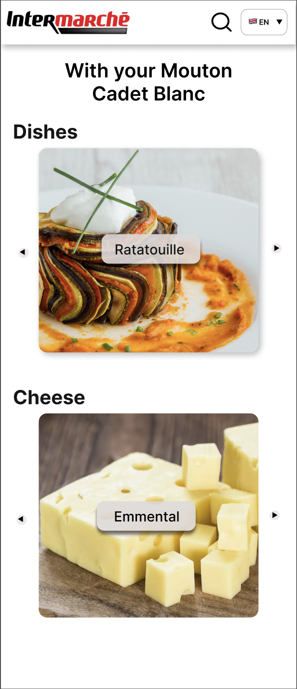
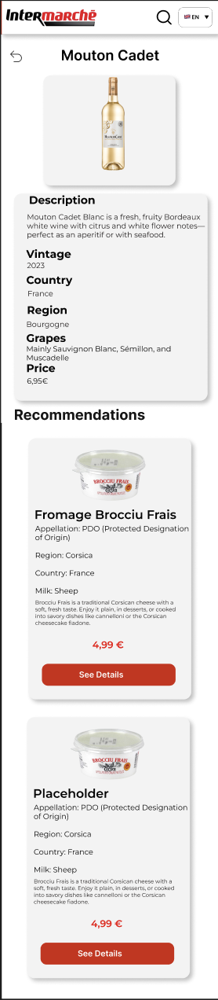
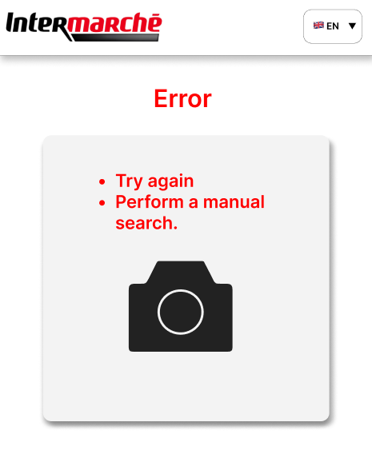

# Functional Specifications – Team 4 - Cheerish

## Table of Contents

- [Functional Specifications – Team 4 - Cheerish](#functional-specifications--team-4---cheerish)
  - [Table of Contents](#table-of-contents)
  - [Introduction](#introduction)
    - [Project Overview](#project-overview)
    - [Project Definition](#project-definition)
      - [Vision](#vision)
      - [Market Analysis](#market-analysis)
      - [Scope](#scope)
      - [Deliverables](#deliverables)
  - [Project Organization](#project-organization)
      - [Project Representatives](#project-representatives)
      - [Development Team](#development-team)
    - [Project Stakeholders](#project-stakeholders)
    - [Project Planning](#project-planning)
      - [Timeline and Task Management](#timeline-and-task-management)
      - [Risk Management](#risk-management)
    - [Resources](#resources)
      - [Team](#team)
      - [Technical Resources](#technical-resources)
      - [Data Resources](#data-resources)
    - [Project Parameters](#project-parameters)
      - [Core Assumptions](#core-assumptions)
      - [Project Constraints](#project-constraints)
    - [Product Matching Strategy](#product-matching-strategy)
      - [Expert Consultation Plan](#expert-consultation-plan)
      - [Research Methodology](#research-methodology)
  - [Audience \& Use Cases](#audience--use-cases)
    - [Target Audience](#target-audience)
      - [The Curious Traveler](#the-curious-traveler)
      - [The Time-Conscious Shopper](#the-time-conscious-shopper)
      - [The Wine Enthusiast](#the-wine-enthusiast)
      - [The Culinary Beginner](#the-culinary-beginner)
    - [Usage Patterns Matrix](#usage-patterns-matrix)
  - [UI/UX](#uiux)
    - [Graphic Charter](#graphic-charter)
    - [Logotype](#logotype)
      - [Cheerish Logo](#cheerish-logo)
      - [Base Logo](#base-logo)
      - [Intermarché Super Logo](#intermarché-super-logo)
      - [Round Intermarché Logo](#round-intermarché-logo)
    - [Logo Usage Guidelines](#logo-usage-guidelines)
    - [Logo Liability Disclaimer](#logo-liability-disclaimer)
    - [Color Palette](#color-palette)
    - [Mockups](#mockups)
      - [Sign-Up Page](#sign-up-page)
      - [QR Code Pages](#qr-code-pages)
        - [Scanned QR Code Page](#scanned-qr-code-page)
        - [Product Selection](#product-selection)
        - [Accompany Page](#accompany-page)
        - [Accompany Page Following](#accompany-page-following)
        - [Recommendation Page](#recommendation-page)
      - [Home Page](#home-page)
      - [Discovery Pages](#discovery-pages)
      - [Product Card](#product-card)
      - [Product Page](#product-page)
      - [Search Page](#search-page)
        - [Page Composition](#page-composition)
      - [Bar-Code Page](#bar-code-page)
        - [Page Composition](#page-composition-1)
  - [Functional Requirements](#functional-requirements)
    - [Multilingual Support](#multilingual-support)
    - [QR Code Accessibility](#qr-code-accessibility)
      - [Example: Wine Aisle QR Code Flow](#example-wine-aisle-qr-code-flow)
      - [If the user chooses "Something to accompany my wine"](#if-the-user-chooses-something-to-accompany-my-wine)
      - [If the user chooses "Find a wine"](#if-the-user-chooses-find-a-wine)
    - [Search Mechanic](#search-mechanic)
      - [Functional Scope](#functional-scope)
      - [Integration with the Filtering System](#integration-with-the-filtering-system)
      - [Simplified User Flow](#simplified-user-flow)
      - [Benefits](#benefits)
    - [List Of Products](#list-of-products)
      - [Meals](#meals)
      - [Wines](#wines)
      - [Cheeses](#cheeses)
    - [Product Tags](#product-tags)
    - [Research Filters](#research-filters)
    - [Bar-Code Scanner](#bar-code-scanner)
    - [Recommendation Algorithm](#recommendation-algorithm)
      - [Functional Criteria](#functional-criteria)
      - [Example Use Case](#example-use-case)
      - [Recommendation Flow](#recommendation-flow)
      - [Cultural Taste Preferences](#cultural-taste-preferences)
    - [Local Product Spotlight](#local-product-spotlight)
      - [Mix \& Match](#mix--match)
  - [Non-Functional Requirements](#non-functional-requirements)
    - [Performance](#performance)
    - [Scalability](#scalability)
    - [Reliability](#reliability)
    - [Accessibility](#accessibility)
  - [Recommended Minimum Hardware Requirements](#recommended-minimum-hardware-requirements)
  - [Future Improvements](#future-improvements)
    - [Integration of Special Offers](#integration-of-special-offers)
    - [User Reviews and Product Ratings](#user-reviews-and-product-ratings)
    - [In-Store Product Location Guidance](#in-store-product-location-guidance)
  - [Legal \& Compliance](#legal--compliance)
    - [Data Protection and Privacy](#data-protection-and-privacy)
    - [Intellectual Property Rights](#intellectual-property-rights)
    - [License and Usage Terms](#license-and-usage-terms)
    - [Legal \& Compliance](#legal--compliance-1)
      - [Usage Rights \& Licensing](#usage-rights--licensing)
      - [Liability \& Disclaimer](#liability--disclaimer)
      - [Legal Responsibility](#legal-responsibility)
  - [Conclusion](#conclusion)
  - [Glossary](#glossary)

## Introduction

This document outlines the **functional specifications** for developing a mobile web application for [Intermarché](https://www.intermarche.com), titled **Cheerish**.
Its objective is to define the project’s functional requirements, scope, and goals, ensuring all stakeholders share a unified understanding of what is being developed.

### Project Overview

The primary aim of this project is to deliver a user-friendly **mobile web application** for Intermarché customers. Upon entering the store, users will be guided in choosing the most suitable wine and/or cheese based on their preferences, planned dishes, or applied filters. The application is designed to simplify the selection process, promote local products, and improve customer satisfaction by offering tailored and context-aware recommendations.

### Project Definition

#### Vision

Our vision is to develop an **open-source mobile web application** as a proof of concept for Intermarché, with the following objectives:

- Simplify food pairing with wine and cheese
- Promote and support **local producers**
- Encourage discovery of **regional specialties**
- Deliver **personalized recommendations** based on user origin, preferences, and budget
- Support a **multilingual audience** to enhance accessibility
- Increase **in-store engagement and sales**
- Provide a **simple, inclusive, and intuitive user interface**
- Allow usage **without requiring user accounts or sign-up**

#### Market Analysis

Intermarché offers a wine recommendation tool via its official website: [Wine Selection Tool](https://www.intermarche.com/recherche/vin). While functional, the existing solution is limited in interactivity and personalization. The Cheerish application aims to address these limitations by offering the following enhancements:

- **No Account Required** – Users can access full functionality without creating an account, reducing entry barriers.
- **Multilingual Accessibility** – Interface and suggestions are available in multiple languages, enhancing usability for tourists and non-native speakers.
- **Context-Aware Personalization** – Suggestions are tailored based on user preferences, origin, season, and product data.
- **Additional Features** – Including cheese/wine pairing suggestions, filters by dish, and local producer highlights.
- **Barcode Scanner Integration** – Users can scan a product to access detailed information and pairing suggestions.

These improvements aim to create a richer, more engaging customer experience and further enhance Intermarché’s in-store digital offering.

#### Scope

This project focuses on building a functional **mobile web application** that assists users in selecting wines and cheeses based on their preferences, shopping context, or meal plans. The application will serve as a **proof of concept** and prioritize ease of use, personalization, and local product promotion.

**In Scope:**

- Development of a **mobile-first web application** (accessible on Android and iOS)
- A **recommendation engine** to assist with wine and cheese pairings
- **User filtering options** (taste, type, region, seasonality, etc.)
- Emphasis on **local and regional producers**
- Lightweight **onboarding process** without account creation
- Basic **UI/UX mockups and implementation**
- Use of a **test database** provided by Intermarché Saint-Rémy de Provence
- Delivery of an **open-source prototype** for future iteration

**Out of Scope:**

- Full integration with Intermarché’s internal databases or e-commerce systems
- Loyalty card or account-specific features
- Direct payment or product ordering functionalities
- AI-powered or machine learning-driven recommendation logic
- Full offline functionality or extensive local caching

This clearly defined scope helps ensure a realistic and focused MVP, enabling feedback collection and evaluation by stakeholders.

**Technology Used:**

The application is being developed using **Bubble.io**, a no-code platform chosen for its agility and suitability for MVP development, for a deeper understanding of Bubble.io, please follow the [link](https://forum.bubble.io).

#### Deliverables

| **Deliverable**           | **Planned Delivery Date** |
| ------------------------- | ------------------------- |
| Functional Specifications | 16/05/2025                |
| Technical Specifications  | 28/05/2025                |
| Test Plan                 | 06/06/2025                |
| User Manual               | 16/06/2025                |
| Final Code                | 16/06/2025                |

## Project Organization

#### Project Representatives

| Entity                             | Representative                                           | Role                   |
| ---------------------------------- | -------------------------------------------------------- | ---------------------- |
| Intermarché's Representative       | [Célia Moustier](mailto:moustier09@hotmail.fr)           | Primary client contact |
| Intern Aisle Responsible           | [Chrys Cadeau](mailto:chryscadeau13@gmail.com)           | In-store coordination  |
| [ALGOSUP](https://www.algosup.com) | [Franck Jeannin](mailto:franck.jeannin@algosup.com)      | Technical advisor      |
| Team 4                             | [ Clémentine Curel](mailto:clementine.curel@algosup.com) | Project Manager        |

#### Development Team

| Team Member      | Role              | Primary Responsibilities                                         | Contact                                                           |
| ---------------- | ----------------- | ---------------------------------------------------------------- | ----------------------------------------------------------------- |
| Clémentine Curel | Project Manager   | Project planning, stakeholder communication, timeline management | [LinkedIn](https://www.linkedin.com/in/clementinecurel/)          |
| Thibaud Marlier  | Program Manager   | Requirements definition, functional specs, scope management      | [LinkedIn](https://www.linkedin.com/in/thibaudmarlier/)           |
| Jason Grosso     | Technical Lead    | Technical architecture, implementation oversight, development    | [LinkedIn](https://www.linkedin.com/in/jason-grosso-847b39251/)   |
| Elone Delille    | Quality Assurance | Testing strategy, quality control, requirements validation       | [LinkedIn](https://www.linkedin.com/in/elonedelille/)             |
| Emilien Chinsy   | Software Engineer | Application development, algorithm implementation                | [LinkedIn](https://www.linkedin.com/in/emilien-chinsy-5a794632b/) |
| Robin Goumy      | Technical Writer  | Documentation, user experience design, interface guidelines      | [LinkedIn](https://www.linkedin.com/in/robin-goumy-66452832a/)    |

### Project Stakeholders

| Stakeholder           | Role                | Primary Interest                                       |
| --------------------- | ------------------- | ------------------------------------------------------ |
| Intermarché Customers | End Users           | Intuitive wine/cheese pairing assistance               |
| Intermarché           | Primary Client      | Enhanced customer experience, increased sales          |
| ALGOSUP               | Technology Partner  | Educational project delivery, technical implementation |
| Development Team      | Implementation Team | Successful project delivery, technical excellence      |

### Project Planning

#### Timeline and Task Management

The project follows an agile methodology with regular sprints and deliverables. A detailed breakdown of tasks, milestones, and deadlines is maintained in our [Trello Project Board](https://trello.com/invite/b/6821a8c3bb16b11da77cd461/ATTI34cce339a8d487fb31dcacb58015e989D1CB4FC3/cheerish).

#### Risk Management

| Risk                               | Consequences                                       | Likelihood | Impact | Mitigation                                                                                       |
| ---------------------------------- | -------------------------------------------------- | ---------- | ------ | ------------------------------------------------------------------------------------------------ |
| Delayed Client's Response          | Deadlines not respected                            | High       | High   | Plan messages in advance, schedule regular meetings, and consolidate questions into one message. |
| Limited Technology Stack           | Functionalities hard/impossible to implement       | High       | High   | Plan development in advance, close collaboration with Technical Leader                           |
| Inaccurate Pairing Recommendations | Poor user experience, low app credibility          | Medium     | High   | Use validated data sources, enable user feedback, consult domain experts                         |
| Ambiguity in Feature Definitions   | Misaligned expectations, rework and delays         | Medium     | High   | Clearly define user stories and acceptance criteria                                              |
| Overcomplexity in UI               | Users abandon app due to confusion                 | Medium     | Medium | Prioritize simplicity, offer "basic" and "advanced" modes                                        |
| Incorrect or Missing Product Data  | Unreliable results, limited functionality          | Medium     | High   | Use reliable databases, allow user corrections with moderation                                   |
| Lack of Domain Expertise           | Incorrect pairing logic, user mistrust             | Medium     | High   | Consult culinary experts or trusted sources                                                      |
| Performance Bottlenecks            | Slow app performance, especially on mobile         | Medium     | Medium | Optimize database and API calls, test on low-spec devices                                        |
| Feature Creep                      | Project delays, diluted focus                      | Medium     | High   | Stick to MoSCoW prioritization, defer non-core features                                          |
| No Mechanism for Feedback/Updates  | App becomes outdated or unresponsive to user needs | Low        | Medium | Add user feedback forms, analytics, and data update mechanisms                                   |

### Resources

#### Team

A team of 6 members, each with clearly defined roles and responsibilities.

- **Estimated Project Duration:** 110 hours
- **Estimated Total Workload:** 660 man-hours

#### Technical Resources

- **Development Platform:** Bubble.io (no-code platform)
- **Support:** Technical guidance from ALGOSUP instructor
- **Testing Environments:**
  - Intermarché store in Issoudun

#### Data Resources

A comprehensive product database has been provided by Intermarché containing:

- Product bar-codes in the following formats:

- **Product database includes:**
  - **Identifiers:**
    - ITM8 codes
    - EAN PRIO bar-codes
  - **Details:**
    - Names and descriptions
    - Origins (region/country)
    - Categories and types
    - Pricing information

Complete specifications are available in the [Wine & Cheese Database (Excel)](../../data/Data%20-%20Wine%20and%20Cheese.xlsx).

### Project Parameters

#### Core Assumptions

- **Client Engagement**

  - Timely feedback from stakeholders
  - Access to subject matter experts

- **Technical Viability**

  - [Bubble.io](#scope) platform capabilities
  - Modern browser compatibility
  - Reliable internet connectivity

- **Data Quality**
  - Accurate product information
  - Consistent classification system
  - Regular updates possible

#### Project Constraints

- **Technical Constraints**

  - Exclusive use of the Bubble.io platform
  - Web-based mobile application
  - Open-source requirement

- **Business Constraints**

  - Alignment with Intermarché brand
  - Compliance with retail standards
  - User privacy requirements

- **Resource Constraints**
  - Fixed team size
  - Defined project timeline
  - Limited budget

### Product Matching Strategy

#### Expert Consultation Plan

- **Wine Specialists:** Professional sommeliers for wine characteristics
- **Cheese Experts:** Artisanal cheese makers for pairing insights
- **Culinary Professionals:** Regional cuisine experts for traditional pairings

#### Research Methodology

- **Literature Review**

  - Academic sources
  - Industry publications
  - Cultural references

- **Expert Interviews**

  - Structured questionnaires
  - Pairing workshops
  - Validation sessions

- **Documentation**
  - Comprehensive pairing guidelines
  - Expert recommendations
  - Regional considerations

Research and interviews will be conducted by Thibaud Marlier and Clémentine Curel throughout the project.

## Audience & Use Cases

### Target Audience

The application is designed for diverse customer types who commonly shop at Intermarché.
**These four personas illustrate the core multilingual, time-sensitive, and curiosity-driven user groups envisioned in our [Vision](#vision) section.** Each represents a key use case for the app in a real in-store context.

#### The Curious Traveler

**Demographics**

- **Age Range:** 25–60
- **Persona:** _Anna, the Curious Traveler_
- **Language:** Non-French speaking
- **Shopping Context:** Vacation/tourism

**Key Characteristics**

- Eager to explore French gastronomy
- Limited knowledge of local products
- May face language barriers
- Interested in authentic experiences

**User Story**

> As a Curious Traveler, Anna wants to discover authentic regional products and understand French wine-cheese pairings, even though she doesn't speak French fluently.

**App Usage Pattern**

- Sets interface to preferred language
- Explores local and regional products
- Uses visual guides and translations
- Seeks cultural context in recommendations

#### The Time-Conscious Shopper

**Demographics**

- **Age Range:** 30–55
- **Persona:** _Marc, the Time-Conscious Shopper_
- **Shopping Frequency:** Weekly
- **Time Availability:** Limited

**Key Characteristics**

- Values efficiency and convenience
- Basic wine/cheese knowledge
- Focused on practical choices
- Price-conscious decisions

**User Story**

> As a Time-Conscious Shopper, Marc needs quick and reliable recommendations for wine and cheese that will complement his planned family meals.

**App Usage Pattern**

- Quick meal-based searches
- Straightforward filtering
- Price-range focused
- Efficient decision-making

#### The Wine Enthusiast

**Demographics**

- **Age Range:** 35–65
- **Persona:** _Claire, the Wine Enthusiast_
- **Knowledge Level:** Advanced
- **Interest:** High engagement

**Key Characteristics**

- Deep wine knowledge
- Appreciates quality and authenticity
- Interest in artisanal products
- Values detailed information

**User Story**

> As a Wine Enthusiast, Claire wants to discover unique local wines and artisanal cheeses, while understanding their origins and pairing possibilities.

**App Usage Pattern**

- Advanced filtering options
- Detailed product information
- Regional/terroir focus
- Expert-level recommendations

#### The Culinary Beginner

**Demographics**

- **Age Range:** 18–30
- **Persona:** _Lucas, the Culinary Beginner_
- **Experience Level:** Novice
- **Learning Style:** Experimental

**Key Characteristics**

- Open to learning
- Limited experience
- Budget-conscious
- Social consumption context

**User Story**

> As a Culinary Beginner, Lucas wants beginner-friendly guidance that helps him make confident choices within his budget.

**App Usage Pattern**

- Basic preference selection
- Educational content
- Simple language
- Budget-friendly options

### Usage Patterns Matrix

| User Type        | Primary Goals           | Key Features Used               | Success Metrics         |
| ---------------- | ----------------------- | ------------------------------- | ----------------------- |
| Tourists         | Cultural discovery      | Language selection, local focus | Cultural authenticity   |
| Busy Parents     | Quick, reliable choices | Meal-based recommendations      | Time to decision        |
| Wine Enthusiasts | Detailed exploration    | Advanced filters, origin info   | Product knowledge depth |
| Beginners        | Learning and confidence | Basic guidance, education       | Confidence in choices   |

## UI/UX

### Graphic Charter

This project follows the official Intermarché graphic charter to ensure visual consistency and brand recognition. The following elements reflect the branding guidelines.

### Logotype

The web application uses official Intermarché logos provided under the brand’s existing identity. Below are the logos available for use:

#### Cheerish Logo

Cheerish is the name and logo our team created specifically for this project.

The logo was designed to visually represent the core values and purpose of the application. It includes:

- **A piece of cheese**, symbolizing one of the two main product categories the app focuses on.
- **A wine glass**, representing the second core product and evoking moments of tasting and enjoyment.
- **A heart**, placed above the glass to express warmth, appreciation, and the emotional connection people often have with good food and shared experiences.
- **The name _Cheerish_**, a blend of the words _cheer_ and _cherish_, captures the spirit of celebration, discovery, and the appreciation of fine wine and cheese.

Together, these elements embody the user experience we aim to deliver—personalized, joyful, and rooted in cultural and culinary appreciation.

#### Base Logo

This is the main Intermarché logo, used primarily for branding, advertising, and digital web applications.

#### Intermarché Super Logo

This logo represents **Intermarché Super**, supermarkets with a strong focus on fresh food products, tailored to local clientele.
It is the **primary logo** for this project, as the main client is **Intermarché Super in Saint-Rémy-de-Provence**.

#### Round Intermarché Logo

This round version of the logo is ideal for **loading pages** or compact areas where a circular design is more fitting.

### Logo Usage Guidelines

According to Intermarché’s official branding policy:

- The logo must **not** be altered in shape, proportions, or color.
- A **minimum usage size of 25mm** is required for optimal readability.
- Logos must be displayed on a **white background** to maintain visual clarity.

### Logo Liability Disclaimer

For information about logo liability see [Legal \& Compliance](#legal--compliance) → Intellectual Property Rights.

### Color Palette

The application’s color scheme aligns with Intermarché’s official brand colors to maintain consistency.

| Color     | RGBA Value         | Example                                       |
| --------- | ------------------ | --------------------------------------------- |
| **Red**   | 226, 0, 26, 100    |      |
| **Black** | 26, 23, 26, 100    |  |
| **Grey**  | 220, 220, 220, 100 |    |

### Mockups

A visual prototype of the application has been designed using Figma. You can view the interactive mockup [here](https://www.figma.com/design/FiDisAv5pKKYsvQBODIIYx/BUBBLE-INTER?node-id=0-1&t=5USWv2xX2utpUy6t-1).

This mockup outlines the core user flows and primary pages of the application, with a focus on intuitive navigation and an engaging user experience.

Note: Screenshots are for illustration only; focus on the described functionality rather than visual polish.

#### Sign-Up Page

Although not a traditional user sign-up, this onboarding process helps tailor the experience by understanding the user’s background. The choices made here are essential for personalized recommendations — for instance, a user from the United Kingdom might receive different pairings than one from Germany. More details can be found in the [Recommendation Algorithm](#recommendation-algorithm) section.

**Information Collected:**

- The user's country of origin — used to refine recommendation logic
- The language spoken — used for full interface translation

**UI Elements:**

- Two dropdown fields: one for selecting the country, and one for the preferred language
- A "Continue" button that is **disabled** by default and becomes **active** only when both fields are filled

**Available Countries:**

- France
- United Kingdom
- Spain
- Germany
- Italy
- China
- Other

Supported languages can be found in the [Multilingual Support](#multilingual-support) section.

**Button Behavior:**

- **Disabled state:** Grey background, inactive

- **Enabled state:** Red background, active

These button colors are defined in the [Color Palette](#color-palette) section.

**Button Values**

- Height: 30px
- Width: 195px
- Centered
- Padding: 15px

#### QR Code Pages

This section outlines the design of the QR code-related pages. For in-depth functionality and technical details, refer to the dedicated [QR Code Accessibility](#qr-code-accessibility) section.

##### Scanned QR Code Page

This introductory page appears after scanning a QR code and includes:

- The location where the QR code was scanned, which may be:

  - At the **shop entrance**
  - In the **wine aisle**
  - In the **cheese aisle**

- A first button prompts the user to:

  - Find a **cheese**, if the QR code was scanned in the **cheese aisle**
  - Find a **wine**, if the QR code was scanned in the **wine aisle**

- A second button prompts the user to:

  - Find a **product to accompany their wine**, if the scan occurred in the **wine aisle**
  - Find a **product to accompany their cheese**, if the scan occurred in the **cheese aisle**

- If the QR code was scanned at the **shop entrance**, the user is redirected directly to the [Sign-Up Page](#sign-up-page).

##### Product Selection

If the user selects to find a cheese or a wine, they are redirected directly to the appropriate [Discovery Pages](#discovery-pages).

##### Accompany Page

This page allows the user to enter the name of the wine or cheese they are looking to pair.

**Page Elements:**

- **Back Button**

  - Navigates back to the [QR Code Pages](#qr-code-pages)

- **Instructional Text**

  - Prompts the user to input the wine or cheese they have selected

- **Input Box**

  - Allows the user to type in the name of the product

- **Confirmation Button**

  - Confirms the selection and redirects to the [Accompany Page Following](#accompany-page-following)
  - Styled and functions similarly to the button described in the [Sign-Up Page](#sign-up-page)

##### Accompany Page Following

This page allows the user to choose what kind of pairing they are looking for.

**Page Elements:**

- **Back Button**

  - Navigates back to the [Accompany Page](#accompany-page)

- **Instructional Text**

  - Ask the user what they would like to pair with their selected product

- **Dropdown Menu**

  - Options include:

    - **Cheese/Wine**
    - **Dish**
    - **Both**

- **Confirmation Button**

  - Same style and behavior as described in the [Sign-Up Page](#sign-up-page)
  - Leads the user to the [Recommendation Page](#recommendation-page)

##### Recommendation Page

This page displays product recommendations based on the user's previously selected product and pairing preferences.

**Page Elements:**

- **Header**
  Includes:

  - The Cheerish logo
  - A search icon linked to the [Search Mechanic](#search-mechanic)
  - A language selection button as described in the [Multilingual Support](#multilingual-support) section

- **Contextual Text**

  - For example: _"With your \[product]"_

- **Product Carousels**

  - If the user requested a **dish**, **wine**, or **cheese**, a single carousel appears showing suggested products based on [Product Tags](#product-tags)
  - If the user requested **both**, two carousels are displayed

#### Home Page

The Home Page serves as the main page of the application. It is the main interface the user interacts with and offers quick access to key features and content.

The page is composed of four main sections:

- **Header**

The header includes the following elements:

- The application’s logo
- A magnifying glass icon representing the [Search Mechanic](#search-mechanic) functionality
- A language switcher button, as described in the [Multilingual Support](#multilingual-support) section

- **Browse Categories**

This section is designed to guide the user through available options and includes:

- A friendly welcome message
- A brief explanatory sentence encouraging exploration of the platform
- Four action buttons leading to various discovery pages:

  - **See Menus** – Redirects to a complete list of available menus
  - **Discover Our Wines** – Displays the full wine selection
  - **Cheese Selection** – Presents the complete list of cheeses
  - **View Catalogue** – Shows all available products, including menus, cheeses, and wines

> **Note:**
> These four buttons lead to what are referred to as **Discovery Pages**. You can find more information in the [Discovery Pages](#discovery-pages) section.

- **Recommendations**

This section includes personalized product suggestions based on user preferences, as detailed in the [Recommendation Algorithm](#recommendation-algorithm) section. It contains:

- A horizontally scrollable carousel with 2–5 product recommendations
- Product cards that include:

  - [Product Tags](#product-tags)
  - Product price
  - A brief description
  - A call-to-action button linking to the full [Product Page](#product-page)

  

#### Discovery Pages

Discovery Pages serve as the main category pages for product browsing. These categories include:

- Meals
- Wines
- Cheeses

Each page acts as a showcase for the respective category, displaying all available products along with relevant information.

The pages are composed of the following sections:

- **Header**

  - Identical to the header described in the [Menu Page](#menu-page) section.
  - Contains the logo, search icon, and language selection button.

- **Back Button**

  - A simple button that returns the user to the Menu Page.

- **Search Bar**

  - A minimal design with a magnifying glass icon and input field.
  - Enables users to search for specific products or refine results alongside filter options.
  - Example: typing "white wine" returns only white wines.

- **Filters**
  Filters allow users to narrow down their product search. Filter options include:

  - **Type of Wine** or **Type of Milk (for cheeses)** – See [Research Filters](#research-filters) for more details

  - **Price Range**

    - €0 to €5
    - €5 to €15
    - Over €15

  - **Country of Origin**

  - **Selected Dish** – The user selects a dish they wish to prepare; the system recommends suitable wines or cheeses.

  - **Selected Cheese** – The user selects a cheese they have; the system suggests compatible dishes or wines.

  - **Selected Wine** – The user selects a wine they have; the system recommends complementary dishes or cheeses.

  - **Reset Button** – Reinitializes all filters to their default state.

  > **Note:**
  > The "Selected ..." filters require the user to choose from products already present in the database (external products are not supported).
  > These filters will appear as dropdowns with search functionality to simplify selection.

- **Recommendations Section**

  - Displays product cards based on the applied filters.
  - If no filters are applied, the full list of products in the selected category is shown.

  

#### Product Card

Product Cards highlight individual products across various pages. They are designed to present essential information clearly and attractively. Below is the design reference:

  

Each card includes:

- An image of the product
- Product name
- [Product Tags](#product-tags)
- A short description (maximum 30 words)
- Price
- A **See Details** button that links to the product’s dedicated page

**Design Specifications:**

- Rounded corners: 7°
- Black drop shadow
- Height: 40% of the screen height
- Width: 80% of the screen width
- Background color: Grey

#### Product Page

The Product Page is where users can view detailed information about a selected product, whether it is a wine or a cheese.

This page is composed of the following elements:

- **Header**

  - Consistent with the header described in the [Menu Page](#menu-page) section.
  - Includes the application logo, a search icon, and a language selection button.

- **Back Button**

  - Allows users to return to the Discovery Page corresponding to the product's category (wine or cheese).

- **Product Name**

  - Displayed prominently at the top of the page to highlight the product.

- **Product Image**

  - A visual of the product shown in a dedicated image container.

- **Descriptive Card**

  - Provides comprehensive product information, including:

    - Product description
    - Vintage (for wines) or cheese type
    - Country of origin
    - Region
    - Appellation (e.g., PDO, AOC)
    - Grape variety or type of milk used
    - Price

- **Recommendations**

  - Displays suggested products that pair well with the selected item.
  - These recommendations are **pre-defined (hard-coded)** and not based on dynamic algorithms.
  - Each suggested product appears as a card, following the structure described in the [Product Card](#product-card) section.

#### Search Page

The Search Page is dedicated to helping users find specific products or refine their search using various filters. It is accessed by clicking the search icon located in the header.

##### Page Composition

- **Search Bar**

  - An input field that allows users to search for a product by name.
  - Supports partial input and smart matching, as detailed in the [Search Mechanic](#search-mechanic) section.

- **Language Dropdown**

  - Enables the user to switch languages.
  - Available options are defined in the [Multilingual Support](#multilingual-support) section.

- **Filter Box**

  - Provides advanced filtering options to refine search results:

    - **Price**
    - **Product Type** (Cheese, Wine, Dish)
    - **Country of Origin**
    - **Seasonality** (for seasonal products)

  - Includes a **Reset Button** to clear all selected filters and return to default values.

- **Product Output Section**

  - Displayed below the filter box.
  - Shows matching products using the same card layout as described in the [Discovery Pages](#discovery-pages).

For more information about the underlying mechanics of search and filtering, refer to:

- [Search Mechanic](#search-mechanic)
- [Research Filters](#research-filters)
- [Product Tags](#product-tags)

#### Bar-Code Page

This page is dedicated to accessing the bar-code scanner feature. It can be accessed from the [Search Page](#search-page).

##### Page Composition

- **Header**

  - Matches the design of the header described in the [Menu Page](#menu-page) section.
  - Contains the application logo and a language selection button.
  - **Note**: The search icon is intentionally excluded on this page.

- **Barcode Scan Button**

  - A large, central button occupying 80% of the page’s width and height.
  - When pressed, it activates the device’s camera to scan the bar-code of a product.

For more information about the bar-code scanner’s functionality, refer to the [Barcode Scanner](#bar-code-scanner) section.

## Functional Requirements

### Multilingual Support

- **Functionality:**
  The mobile application must be available in multiple languages.

- **Details:**

  - The following languages must be supported:

    - French
    - English
    - Spanish
    - German
    - Italian
    - Chinese

  - Additional languages can be supported, but are not mandatory.
  - The entire application interface must be fully translated automatically when a language is selected.

### QR Code Accessibility

- **Functionality:**
  The application should be accessible by scanning a QR code.

- **Details:**

  - Three QR codes will be placed in the store:

    - At the store entrance
    - Near the wine aisle
    - Near the cheese aisle

  - Each QR code will redirect users to a **personalized interface** based on their location.

#### Example: Wine Aisle QR Code Flow

When the user scans the QR code near the **wine aisle**, the following screen appears:

The user is presented with two options:

- **Find a wine** based on their preferences
- **Something to accompany my wine** (such as food or cheese) for a wine they already have

#### If the user chooses "Something to accompany my wine"

- The user is prompted to input the **name of the wine** they have selected.
- After submission, they are redirected to the product page, which includes:

  - Suggested **dishes** that pair well with the wine
  - Recommended **cheeses** that complement both the wine and the chosen dish

> [!NOTE]
> More information about the recommendation system can be found in the [Recommendation Algorithm](#recommendation-algorithm) section.

#### If the user chooses "Find a wine"

- The user can apply filters to refine their search, including:

  - **Price range**
  - **Country of origin**
  - **Selected dish**
  - **Selected cheese**
  - **Additional preferences**

> [!NOTE]
> Details about filtering options can be found in the [Research Filters](#research-filters) section.

### Search Mechanic

The search feature enables users to quickly find products—either wines or cheeses—within the application using keyword-based input. It is designed to be fast, intuitive, and responsive to user queries.

#### Functional Scope

- **Search by Name**
  Users can locate a product by entering part or all of its name. The search engine supports:

  - Partial matches
  - Case insensitivity
  - Accented character recognition
    This ensures a user-friendly and accessible experience.

- **Instant Results**
  As users type, the interface dynamically displays results in real-time, enabling a faster and smoother search experience.

- **Error Tolerance**
  The system handles minor typos or alternate spellings (e.g., "camember" returns **Camembert**) to improve accuracy and usability.

#### Integration with the Filtering System

In addition to keyword search, users can refine results using the application's built-in filtering and tagging systems. Filters may include:

- Product category
- Region of origin
- Price range
- Type of wine or cheese

**See:** [Product Tags](#product-tags), [Research Filters](#research-filters)

#### Simplified User Flow

1. The user accesses the search bar from the Home Screen or Product List view.
2. They input a product name or relevant keyword.
3. A list of dynamically updated matching results is displayed.
4. The user can apply filters and tags to further narrow the results.
5. Selecting a product redirects the user to its detailed Product Page.

#### Benefits

- Enables quick access for returning users or those with specific goals.
- Increases user satisfaction through fast, intelligent search behavior.
- Encourages exploration and discovery of related products via tags and filters.

### List Of Products

#### Meals

- **Functionality**:

  - Display traditional meals with matching wine and cheese recommendations.
  - [meal.json](../../data/meal.json)

- **Details**:

  - name
  - region
  - allergens
  - image
  - short description (FR/EN)
  - recommended wine types
  - recommended cheese tags

- **Example**:
  _Boeuf Bourguignon_
  → Wine: `Red`
  → Cheese: `hard cheese`, `cow cheese`

#### Wines

- **Functionality**:

  - Display wines and allow filtering by type, region, country, grape, or price.
  - [wines.json](../../data/wines.json)

- **Details**:

  - name
  - year
  - type (e.g. Red, White, Rosé)
  - region, country
  - grape varieties
  - price, rating
  - description (FR/EN)
  - image

- **Example**:
  _Domaine de Valdition Rosé Tradition_
  → Type: `Rosé`, Year: `2023`
  → Grapes: `Vermentino, Syrah, Grenache...`
  → Price: `10.5 €`

#### Cheeses

- **Functionality**:

  - Display cheeses and allow filtering by type, milk, region, or country.
  - [cheese.json](../../data/cheese.json)

- **Details**:

  - name
  - type (e.g. soft, hard, AOP...)
  - milk (e.g. cow, goat, sheep)
  - region, country
  - price
  - description
  - image

- **Example**:
  _Tomme de Savoie_
  → Type: `semi-hard cheese`, Milk: `cow`
  → Region: `Savoie`

### Product Tags

- **Functionality:**
  - The mobile application must display product tags to regroup products based on their type.
  - The tags must be **clickable** to filter the product list based on the selected tag.
- **Details:**
  - The tags must be displayed in a **horizontal list** format.
  - The tags must be **color-coded** to indicate the type of product they represent.
- **List of tags:**

| Category          | Tags                                                                                                                                                                                                                                                                                                                                                                                                                                                                    | Color Code                 |
| ----------------- | ----------------------------------------------------------------------------------------------------------------------------------------------------------------------------------------------------------------------------------------------------------------------------------------------------------------------------------------------------------------------------------------------------------------------------------------------------------------------- | -------------------------- |
| **Region**        | Alpilles, Alsace, Ardèche, Auvergne, Bandol, Basque Country, Bourgogne, Brittany, Camargue, Cévennes (Languedoc-Roussillon), Côtes de Provence, Dauphiné, EU, France, Gard, Île-de-France, Languedoc, Les Baux-de-Provence, Loire Valley, Lorraine, Luberon, Méditerranée, Normandie, Nord de l'Afrique, Pays Basque, Pays d'Oc, Périgord – Quercy, Poitou, Poitou–Charentes, Provence, Quercy, Rhône-Alpes, Savoie, South-West, Spain, Sud-Ouest, Var, Veneto, Ventoux | `#FFA07A` (Light Salmon)   |
| **Country**       | Cyprus, France, Greece, Italy, Spain                                                                                                                                                                                                                                                                                                                                                                                                                                    | `#FFD700` (Gold)           |
| **Meal Allergen** | Gluten, Lactose                                                                                                                                                                                                                                                                                                                                                                                                                                                         | `#FF4500` (Orange Red)     |
| **Wine Type**     | Rosé, White, Red, Sparkling, Fuzzy, Champagne                                                                                                                                                                                                                                                                                                                                                                                                                           | `#BA55D3` (Medium Orchid)  |
| **Wine Grape**    | Aligoté, Blend blanc espagnol, Blend blanc générique, Cabernet Sauvignon, Caladoc, Carignan, Cinsault, Chardonnay, Glera, Grenache, Grenache Blanc, Grenache Noir, Loin de l’Oeil, Mauzac, Merlot, Mourvèdre, Muscadelle, Pineau d’Aunis, Rolle, Roussanne, Shiraz/Syrah, Syrah, Tibouren, Ugni Blanc                                                                                                                                                                   | `#8FBC8F` (Dark Sea Green) |
| **Cheese Type**   | AOP goat cheese, AOP semi-soft cheese, Fresh cheese, Fresh goat cheese, Fresh log cheese, Goat cheese, Semi-hard cheese, Soft cheese, Triple-cream cheese, Yogurt                                                                                                                                                                                                                                                                                                       | `#87CEFA` (Light Sky Blue) |
| **Cheese Milk**   | Buffalo, Cow, Goat                                                                                                                                                                                                                                                                                                                                                                                                                                                      | `#F4A460` (Sandy Brown)    |
| **Season**        | Summer, Spring, Winter, Autumn                                                                                                                                                                                                                                                                                                                                                                                                                                          | `#DAB1DA` (Light Purple)   |

### Research Filters

- **Functionality:**
  The mobile application must allow users to apply filters when searching for products.

- **Details:**

  The Users can use the following filters to refine their search:

  - the type of product,
  - the price range,
  - the seasonality of the product,
  - the region or country of origin

  If the Users specify the type of product they are looking for, they will have access to specific filters for that type of product:

  - for the **wine** type, the user unlocks the following filters:
    - the color of the wine (red, white, rosé, sparkling),
    - the grape variety,
    - the sweetness level (dry, semi-dry, sweet),
    - the alcohol content
  - for the **cheese** type, the user unlocks the following filters:
    - the milk type (cow, goat, sheep),
    - the texture (soft, hard, semi-soft),
    - the aging process (fresh, aged, blue-veined),
    - the flavor profile (mild, strong, spicy)
  - for the **meal** type, the user unlocks the following filters:
    - the dietary restrictions (vegetarian, vegan, gluten-free),
    - the region of origin (Provence, Bordeaux, ...)

### Bar-Code Scanner

- **Functionality:**

The application allows users to scan a product (wine or cheese) using its bar-code. Upon scanning, the app automatically identifies the product and redirects the user to its associated product page. This page includes relevant information such as the product’s name, description, price, origin, and tasting suggestions.

- **User Flow:**

- **Benefits:**

  - Fast and intuitive access to product information.
  - Enhanced customer experience in-store or during demonstrations.
  - Time-saving and efficient browsing.

Once the product is successfully scanned, the user is redirected to the corresponding product page. For more information, refer to the [Product Page](#product-page) section.

### Recommendation Algorithm

The recommendation system provides personalized product suggestions based on contextual factors related to the user and their environment. Its goal is to enhance the relevance of the product discovery experience by suggesting items that align with user preferences and seasonal trends.

#### Functional Criteria

The algorithm will take the following criteria into account:

- **User's Origin**
  Regional and cultural backgrounds can influence taste preferences, consumption habits, and openness to new products.

- **Product Price Range**
  Recommendations will respect the user's purchasing habits or declared price sensitivity, offering items within a familiar or preferred price range.

- **Current Season**
  The system adapts to seasonal trends (e.g., lighter wines in summer, hearty cheeses in winter) to promote more timely and appropriate suggestions.

#### Example Use Case

A user from the South of France scans a mid-range cheese during winter. Based on this context, the app may suggest:

- A robust red wine from the same region.
- Other regional cheeses are typically consumed in winter.
- Ongoing promotions for similar products within the same price range.

#### Recommendation Flow

#### Cultural Taste Preferences

The following table is based on market research and reflects general wine and cheese preferences by nationality:

| Nationality | Wine Preferences                                                                                         | Cheese Preferences                                                                                                                      |
| ----------- | -------------------------------------------------------------------------------------------------------- | --------------------------------------------------------------------------------------------------------------------------------------- |
| **British** | - Favor red wines (especially Bordeaux)   - Open to white and rosé during warmer months               | - Soft classics: Brie, Camembert   - Curious about strong types: Époisses, Roquefort   - Trend: Fromage Blanc, Chèvre             |
| **Spanish** | - Prefer red wines due to cultural familiarity   - Choose rosé or white wines in summer               | - Cheeses similar to Manchego: Comté, Tomme de Savoie, Ossau-Iraty                                                                      |
| **German**  | - Prefer white and rosé wines, especially dry varieties   - Enjoy Alsace wines like Riesling          | - Mild alpine cheeses: Emmental, Raclette, Munster                                                                                      |
| **Italian** | - Mainly red wines   - Also open to white and sparkling wines (e.g., Champagne)                       | - Soft and flavorful cheeses: Brie de Meaux, Roquefort, Reblochon                                                                       |
| **Chinese** | - Strong preference for red wines (especially Bordeaux)   - Growing interest in white/sparkling wines | - Prefer mild, approachable options: Brie, Camembert, Fromage Blanc   - Rising interest among youth in more diverse cheese varieties |

### Local Product Spotlight

#### Mix & Match

- **Functionality:**

  The Mix & Match section offers complete tasting suggestions for users who are curious or unsure about what to try. Each suggestion includes a curated combination of:

  - one meal
  - one wine
  - one cheese

- **Details:**

  - Combinations are created by specialists to ensure balance and quality.
  - Only local products are used in these pairings.
  - Users cannot generate new suggestions—combinations are fixed and manually curated.
  - Tapping on a Mix & Match opens a dedicated page with detailed descriptions of the three selected products.
  - This feature is designed to guide users who:
    - Want inspiration from experts
    - Are looking for a full food and wine experience
    - Prefer ready-made, high-quality recommendations

- **Examples:**

| #   | Meal                   | Wine                                           | Cheese                                          |
| --- | ---------------------- | ---------------------------------------------- | ----------------------------------------------- |
| 1   | Cod Brandade           | Roche Mazet Cinsault–Grenache Rosé             | Figou (goat cheese with fig)                    |
| 2   | Salmon Steak           | Cave Terra Ventoux Secret de Truffle Red       | Flower-coated Tomme                             |
| 3   | Tartiflette            | Roche Mazet Merlot                             | Cranberry-coated Goat Cheese (80 g)             |
| 4   | Shepherd’s Pie         | Domaine de Lagoy White Organic Cuvée Classique | Saint-Félicien Faisselle – Saint-Marcel (260 g) |
| 5   | Beef Stew (Pot-au-feu) | Val de L'Oule Red Frisson                      | Tome of Provence                                |

## Non-Functional Requirements

### Performance

- The application must offer a **fluid and responsive user experience** across supported mobile devices and modern web browsers.

- **Page load time** should not exceed **2 seconds** under typical usage conditions.
  This benchmark is based on industry standards (e.g., [Google Web Vitals](https://web.dev/vitals/)) which suggest that users begin to perceive delays and friction when pages take longer than 2–3 seconds to load. A 2-second target balances performance with realism for a mobile-first web application.

- **Normal network conditions** refer to a mobile user with:

  - A **4G connection** (or equivalent Wi-Fi),
  - Minimum **5 Mbps download speed**,
  - **Latency** under **100 ms**.
    These reflect common network conditions in France and Europe during in-store usage.

- **Search queries** and **recommendation results** should be returned within **1 second** to maintain the perception of responsiveness and encourage exploration.

- The backend architecture must be capable of serving **at least 100 concurrent users** simultaneously without performance degradation—appropriate for a mid-sized Intermarché store or proof-of-concept deployment.

### Scalability

- The system must be scalable to support future growth, including:

  - An increasing number of users (up to 10,000+ active users).
  - Additional products (e.g., regional additions to wine and cheese).
  - Expansion into new countries or language support.

- The application architecture should support easy deployment to new shops or regions without structural changes.

### Reliability

- The system must achieve **99.5% uptime** on a monthly basis.
- All critical user data (e.g., preferences, search history, selections) should be saved reliably, even in case of crashes.
- A fallback mechanism must be in place to handle third-party service failures (e.g., translation, bar-code scanning).

### Accessibility

- All functionalities should be usable by people with visual impairments, including support for:

  - Screen readers
  - High contrast modes
  - Keyboard navigation

- Texts should be legible across various screen sizes, and interactions must be intuitive and user-friendly.

## Recommended Minimum Hardware Requirements

To ensure a smooth and enjoyable experience with the Cheerish mobile web application, users should access the app on reasonably modern portable devices. The application is designed to be compatible with most smartphones and tablets currently in use while excluding very outdated models.

| **Requirement**         | **Details**                                                                                    |
| ----------------------- | ---------------------------------------------------------------------------------------------- |
| **Device Type**         | Smartphone or tablet with touchscreen                                                          |
| **Operating System**    | A device running a recent version of Android (Android 9 Pie or later) or iOS (iOS 12 or later) |
| **Internet Connection** | Must have access to mobile data (3G/4G/5G) or Wi-Fi                                            |
| **Screen Size**         | A standard screen size that allows comfortable reading and navigation                          |
| **Camera Access**       | Needed for scanning QR codes and bar-codes                                                     |

> The application is not designed for use on very old smartphones or devices without internet access or camera functionality.

## Future Improvements

### Integration of Special Offers

To enhance the value of the bar-code scanning feature, the application could integrate real-time promotional offers. When a user scans a product, the system displays:

- Active promotions
- Available discounts
- Loyalty program benefits linked to that item

This enhancement would encourage immediate purchasing decisions and deliver a more personalized shopping experience. Offers could be configured to be time-sensitive, user-specific, or part of store-wide campaigns, with management handled through an internal administrative interface.

### User Reviews and Product Ratings

Adding a product review and rating system would increase user engagement and foster trust in product quality. After scanning or searching for an item, users would be able to access community feedback such as:

- Star ratings
- Written reviews
- Usage tips and personal preferences

This feature would be particularly valuable for wine and cheese products, where individual taste plays a significant role. User-generated content would assist others in making informed choices and introduce a social, community-driven aspect to the application.

### In-Store Product Location Guidance

To streamline the in-store shopping experience, the application could indicate the physical location of scanned or searched products within a specific Intermarché store. This may include details such as:

- Aisle number
- Shelf location
- Section indicators

Integrating with the store’s planogram system, this feature would reduce the time customers spend locating items, increase overall satisfaction, and improve accessibility—especially during peak hours or for first-time visitors.

## Legal & Compliance

### Data Protection and Privacy

The application follows strict data protection and privacy guidelines:

- **No User Data Storage**: The application does not store any personal data related to users. All preferences and settings are maintained only for the duration of the session.

- **GDPR Compliance**: Although no personal data is stored, the application adheres to GDPR principles by:

  - Not collecting unnecessary information
  - Being transparent about data usage
  - Not sharing any user information with third parties

- **Cookie Policy**: The application uses no tracking or marketing cookies.

### Intellectual Property Rights

- **Product Data**: All product information, including images and descriptions, is the property of Intermarché and is used with permission.
- **App Content**: The application's content, including the recommendation algorithm and pairing suggestions, is protected by copyright.

> **Disclaimer:**
> All logos used in this project are the intellectual property of **Intermarché** and its affiliates.
> They are used **exclusively** for educational, prototyping, or demonstrative purposes, and **not for commercial redistribution**.
> Our team claims **no ownership** over these visual assets.

### License and Usage Terms

- **Open Source**: The application is open-source software, allowing for community contributions and transparency.
- **Commercial Use**: The implementation is specific to Intermarché's requirements and may not be used commercially without explicit permission.

### Legal & Compliance

This application is developed as part of a proof-of-concept for **Intermarché** and is governed by both open-source and commercial usage considerations.

#### Usage Rights & Licensing

- The project is published as an **open-source prototype**, intended for educational, demonstrative, and non-commercial use.
- The **source code is available for inspection** under the terms of the applicable open-source license.
- Any **commercial use**, **adaptation**, or **redistribution** of the application, in whole or in part, requires **explicit written permission** from Intermarché or the owning stakeholders.

#### Liability & Disclaimer

- The application provides **automated recommendations** (e.g., wine and cheese pairings) based on predefined filters, general culinary guidelines, and basic matching logic.
- These recommendations are **suggestions only** and do **not constitute professional advice**.
- Users are responsible for evaluating all product recommendations based on their personal needs, including:

  - **Alcohol consumption** (legal age, moderation, context)
  - **Dietary restrictions**, **allergies**, or **cultural practices**
  - **Product accuracy**, availability, and final purchase decisions

#### Legal Responsibility

- Neither Intermarché nor the development team can be held liable for any **misuse**, **misinterpretation**, or **consequences** resulting from the use of this application.
- Users should exercise sound judgment and comply with **local laws**, including those related to alcohol and nutrition.

## Conclusion

The Cheerish mobile web application aims to transform the in-store experience for Intermarché customers by offering intuitive, personalized wine and cheese pairing suggestions. Designed with accessibility, simplicity, and discovery in mind, the app supports a multilingual audience and encourages the promotion of local and regional products. By clearly outlining the functional and non-functional requirements, design principles, and target use cases, this document ensures that all project stakeholders share a common understanding of the goals and expectations.

This functional specification serves as a guiding foundation for the development team and partners, enabling focused collaboration throughout the implementation process. As a proof of concept, Cheerish has the potential to evolve through future enhancements such as user reviews, in-store guidance, and promotional integration, contributing to a richer and more connected shopping experience.

## Glossary

| **Term**                             | **Definition**                                                                                                                          |
| ------------------------------------ | --------------------------------------------------------------------------------------------------------------------------------------- |
| **Cheerish**                         | The project’s mobile-first web application is designed to recommend wine and cheese pairings within Intermarché stores.                 |
| **Functional Specification**         | A document outlining the features, behavior, and structure of a system from a user-centric perspective.                                 |
| **Intermarché**                      | The retail client commissioning the proof-of-concept, part of the French Les Mousquetaires group.                                       |
| **Mobile Web Application**           | A responsive web-based application optimized for mobile use, accessible through browsers on smartphones and tablets.                    |
| **Bubble.io**                        | A no-code development platform used to build web applications without traditional programming.                                          |
| **Proof of Concept (PoC)**           | A prototype developed to validate an idea’s feasibility and gather stakeholder feedback before full-scale development.                  |
| **QR Code**                          | A 2D scannable code used to direct customers to specific app interfaces based on store location (e.g., aisle-based context).            |
| **Tagging System**                   | Structured keywords or attributes (e.g., wine color, milk type) associated with products to support filtering and recommendation logic. |
| **Filtering System**                 | UI/UX feature enabling dynamic narrowing of product results based on structured metadata such as origin, type, or season.               |
| **Planogram Integration** _(future)_ | Potential feature mapping product locations in-store (aisles/shelves), enabling in-shop navigation assistance.                          |
| **Onboarding Flow**                  | Lightweight user setup process used to collect language and country-of-origin inputs to personalize recommendations.                    |
| **Carousel**                         | A horizontally scrollable UI pattern presenting grouped items, such as product suggestions or related content.                          |
| **Open Source**                      | The project’s licensing model—source code is publicly available for inspection, reuse, or contribution under applicable terms.          |
