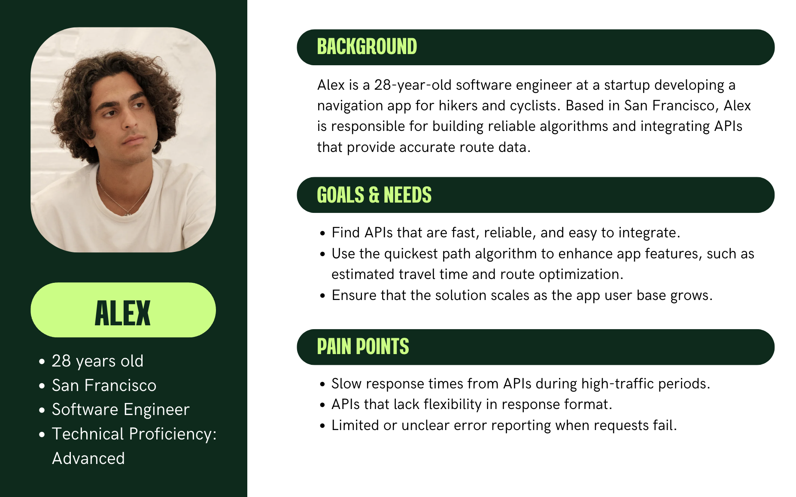
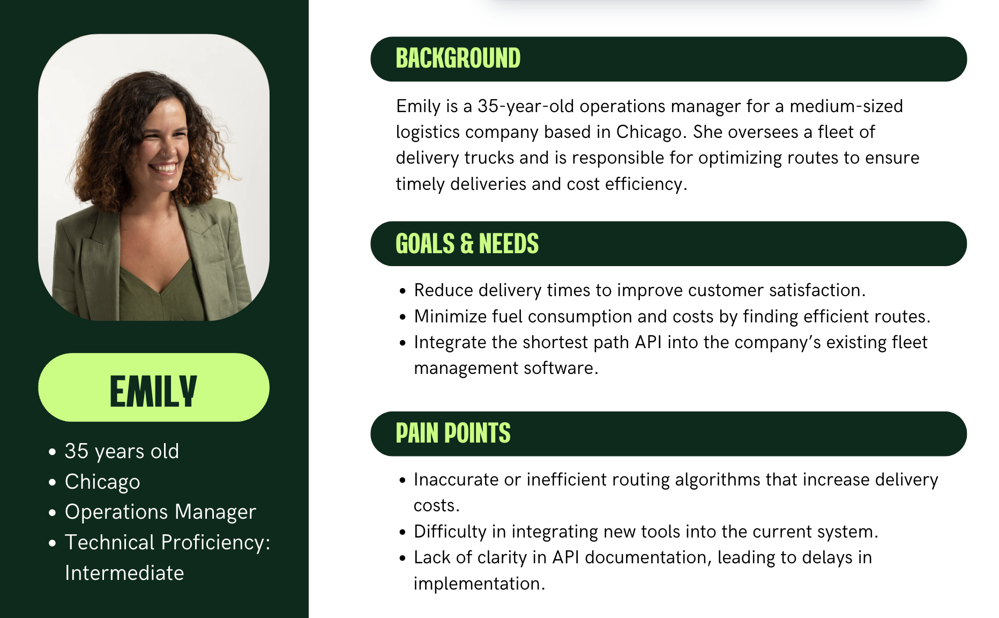
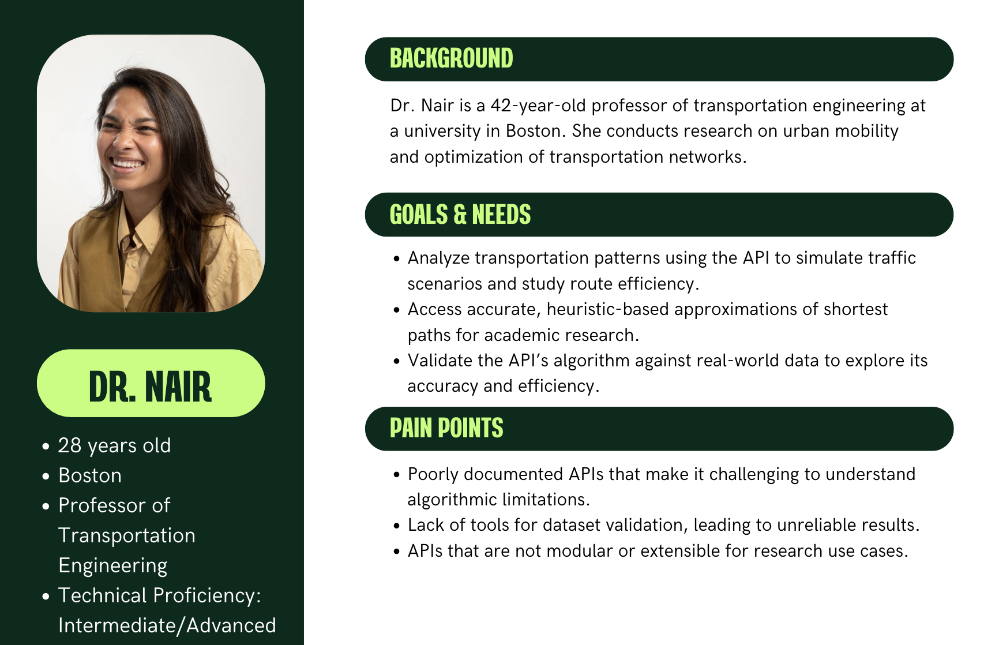
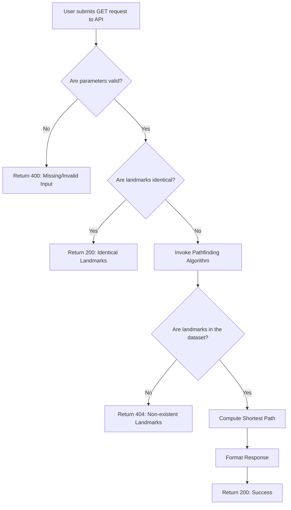

# Functional Specifications

<details>
<summary>Table of Contents</summary>

- [Functional Specifications](#functional-specifications)
  - [1. Introduction](#1-introduction)
    - [1.1. Glossary](#11-glossary)
    - [1.2. Project Overview](#12-project-overview)
    - [1.3. Project Definition](#13-project-definition)
      - [1.3.1. Vision](#131-vision)
      - [1.3.2. Objectives](#132-objectives)
      - [1.3.3. Scope](#133-scope)
      - [1.3.4. Target Audience](#134-target-audience)
      - [1.3.5. Deliverables](#135-deliverables)
    - [1.4. Project Organization](#14-project-organization)
      - [1.4.1. Project Representatives](#141-project-representatives)
      - [1.4.2. Stakeholders](#142-stakeholders)
      - [1.4.3. Project Reviewers](#143-project-reviewers)
    - [1.5. Project Plan](#15-project-plan)
      - [1.5.1. Planning](#151-planning)
      - [1.5.2. Milestones](#152-milestones)
      - [1.5.3. Dependencies](#153-dependencies)
      - [1.5.4. Assumptions/Constraints](#154-assumptionsconstraints)
      - [1.5.5. Risks/Mitigation](#155-risksmitigation)
  - [2. Personas and Use Cases](#2-personas-and-use-cases)
    - [2.1. Personas](#21-personas)
      - [2.1.1. Alex](#211-alex)
      - [2.1.2. Emily](#212-emily)
      - [2.1.3. Dr. Nair](#213-dr-nair)
    - [2.2. Use Cases](#22-use-cases)
  - [3. Functional Requirements](#3-functional-requirements)
    - [3.1. REST API Implementation](#31-rest-api-implementation)
      - [Overview](#overview)
      - [3.1.1. Endpoint Details](#311-endpoint-details)
      - [3.1.2. Response Codes](#312-response-codes)
      - [3.1.3. Request Examples](#313-request-examples)
      - [3.1.4. Response Examples](#314-response-examples)
    - [3.2. Data Verification Tool](#32-data-verification-tool)
      - [3.2.1. Overview](#321-overview)
      - [3.2.2. Key Features](#322-key-features)
        - [3.2.2.1. Data Format Validation](#3221-data-format-validation)
        - [3.2.2.2. Duplicate Connections](#3222-duplicate-connections)
        - [3.2.2.3. Connectivity Check](#3223-connectivity-check)
        - [3.2.2.4. Graph Validation](#3224-graph-validation)
      - [3.2.3. Output](#323-output)
    - [3.3. Pathfinding Algorithm](#33-pathfinding-algorithm)
      - [3.3.1. Overview](#331-overview)
      - [3.3.2. Input Parameters](#332-input-parameters)
      - [3.3.3. Output Details](#333-output-details)
      - [3.3.4. REST API Workflow](#334-rest-api-workflow)
    - [3.4. Program Flow](#34-program-flow)
  - [4. Non-functional Requirements](#4-non-functional-requirements)
    - [4.1. Performance](#41-performance)
    - [4.2. Precision](#42-precision)
    - [4.3. Scalability](#43-scalability)
    - [4.4. Usability](#44-usability)
    - [4.5. Data Integrity](#45-data-integrity)
    - [4.6. Reliability](#46-reliability)
    - [4.7. Maintainability](#47-maintainability)
    - [4.8. Compliance](#48-compliance)

</details>

## 1. Introduction

### 1.1. Glossary

| Term                         | Definition                                                                                                                                      |
| ---------------------------- | ----------------------------------------------------------------------------------------------------------------------------------------------- |
| REST API                     | A web-based interface that allows systems to communicate with each other using the HTTP protocol                                                |
| GET Endpoint                 | A specific URL where the API can be accessed using the HTTP GET method to retrieve information.                                                 |
| JSON                         | A lightweight data-interchange format that uses human-readable and machine-readable text to store and transmit data objects as key-value pairs. |
| XML                          | A markup language that defines rules for encoding documents in a format that is both human-readable and machine-readable.                       |
| HTTP Server                  | A software application that serves content to clients over the Hypertext Transfer Protocol (HTTP).                                              |
| Approximation Heuristics     | A method or technique used to find approximate solutions to problems when exact solutions are impractical or time-consuming to compute.         |
| Dataset                      | A collection of related data entries, often stored in a structured format like CSV files, used for analysis or processing.                      |
| C++                          | A high-performance programming language commonly used for system and application development.                                                   |
| Data Validation Tool         | A utility to check the accuracy, consistency, and integrity of input data against predefined rules or constraints.                              |
| Test Suite                   | A collection of test cases designed to validate the functionality and performance of a software application.                                    |
| Risk Mitigation              | Strategies or actions taken to reduce the likelihood or impact of potential problems or risks in a project.                                     |
| MVP (Minimum Viable Product) | The smallest functional version of a product that can be released to users to gather feedback and validate ideas.                               |
| Landmark                     | A specific point of interest or location used as a reference for calculating routes in the project.                                             |
| Transportation Optimization  | The process of improving the efficiency and effectiveness of transportation systems using algorithms and tools.                                 |
| Directed Acyclic Graph (DAG) | A graph with directed edges where no cycles exist, meaning no path leads back to its starting point.                                            |


### 1.2. Project Overview

This project aims to create a software solution that calculates the quickest path between two landmarks in the United States.

### 1.3. Project Definition

#### 1.3.1. Vision

The vision of our algorithm is to provide a fast, reliable approximation of the shortest path duration between two points in the United States, with the potential to expand globally and integrate with mapping services.

#### 1.3.2. Objectives

- **REST API with the single endpoint:** The software exposes its functionality through an XML and JSON REST API running on an HTTP server with a unique GET endpoint for requests.
- **Response Time:** All queries to the API should be handled in less than 1 second on a typical laptop.
- **Approximation Heuristics:** The returned path should not exceed the shortest path duration by more than 10% when prioritizing speed over precision.

#### 1.3.3. Scope

This software will be developed using C++, a high-performance language that allows fast processing of data. The program will also include an HTTP server running a REST API in XML and JSON format with a single GET endpoint.

#### 1.3.4. Target Audience

The target audience includes:
- Logistics companies seeking efficient routing solutions.
- Developers of navigation applications.
- Researchers in transportation optimization looking for new algorithms.

#### 1.3.5. Deliverables

| Deliverable               | Purpose                                                                                                                                         |
| ------------------------- | ----------------------------------------------------------------------------------------------------------------------------------------------- |
| Functional Specifications | Detailed documentation of the features used and their non-technical aspects.                                                                    |
| Technical Specifications  | Detailed documentation on the technical implementation of software                                                                              |
| Data Validation Tool      | A utility to verify the integrity of the provided CSV file.                                                                                     |
| C++ Source Code           | The source code of the software program, including the shortest path algorithm and the HTTP server.                                             |
| Test Suite                | Tests to validate correctness, performance, and compliance with the 10% approximation rule.                                                     |
| Test Plan & Test Cases    | A set of scenarios validating the algorithm's performance and accuracy with a strategy to run test suite tests most accurately and efficiently. |
| User Manual               | The end-user documentation for the software.                                                                                                    |

### 1.4. Project Organization

#### 1.4.1. Project Representatives

| Full Name             | Role              | Role Description                                                                                                                                                     | Links to LinkedIn Profiles                                              |
| --------------------- | ----------------- | -------------------------------------------------------------------------------------------------------------------------------------------------------------------- | ----------------------------------------------------------------------- |
| Victor LEROY          | Project manager   | Responsible for the overall planning, execution, and success of the project.                                                                                         | [LinkedIn](https://www.linkedin.com/in/victor-leroy-64baa3229/)         |
| Antoine PREVOST       | Program manager   | Ensures the project meets expectations. <br> Is in charge of design. <br> Responsible for writing the Functional Specifications.                                     | [LinkedIn](https://www.linkedin.com/in/antoine-prevost-dev/)            |
| David CUAHONTE CUEVAS | Tech lead         | Makes technical decisions for the project. <br> Translates the Functional Specification into Technical Specifications. <br> Does code review.                        | [LinkedIn](https://www.linkedin.com/in/david-cuahonte-527781221/)       |
| Thomas PLANCHARD      | Software engineer | Writes the code. <br> Writes documentation. <br> Participate in the technical design.                                                                                | [LinkedIn](https://www.linkedin.com/in/thomas-planchard-461782221/)     |
| Mathis KAKAL          | Software engineer | Writes the code. <br> Writes documentation. <br> Participate in the technical design.                                                                                | [LinkedIn](https://www.linkedin.com/in/mathis-k-a239ba10a/)             |
| Max BERNARD           | Quality assurance | Tests all the functionalities of a product to find bugs and issues. <br> Document bugs and issues. <br> Write the test plan. <br> Check that issues have been fixed. | [LinkedIn](https://www.linkedin.com/in/max-bernard-b77680210/)          |
| Quentin CLEMENT       | Technical writer  | Responsible for creating and maintaining the project's documentation.                                                                                                | [LinkedIn](https://www.linkedin.com/in/quentin-cl%C3%A9ment-939110221/) |

#### 1.4.2. Stakeholders

| Role            | Representative | Expectations                                                           |
| --------------- | -------------- | ---------------------------------------------------------------------- |
| Client          | Franck JEANNIN | Finished project meeting requirements                                  |
| School director | Franck JEANNIN | Clear documentation and management based on the skills learnt in class |

#### 1.4.3. Project Reviewers

External project reviewers have been appointed by the project owner to review our specifications and provide us with feedback.

### 1.5. Project Plan

#### 1.5.1. Planning

Planning will follow an iterative approach, with each iteration focused on specific functionality, testing, and validation to ensure quality and performance.

#### 1.5.2. Milestones

| Date         | Milestone                                                                                                                                                                                                                                                                    |
| ------------ | ---------------------------------------------------------------------------------------------------------------------------------------------------------------------------------------------------------------------------------------------------------------------------- |
| **01/13/25** | **Sprint 1:**<br>- Initial version of functional specifications <br>- Testing of the dataset                                                                                                                                                                                 |
| **01/20/25** | **Sprint 2:**<br>- Refined functional specifications <br>- First version of technical specifications <br>- Start of QA sessions <br>- Development of the data verification tool                                                                                              |
| **01/27/25** | **Sprint 3:**<br>- Continued refinement of functional and technical specifications <br>- Ongoing QA sessions and test plan refinement <br>- Further development of the data verification tool <br>- Development and testing of the Shortest Path Algorithm                   |
| **02/03/25** | **Sprint 4:**<br>- Continued refinement of functional and technical specifications <br>- Ongoing QA sessions and test plan refinement <br>- Further development of the data verification tool <br>- User manual first version <br>- Testing of the Shortest Path Algorithm   |
| **02/07/25** | **Sprint 5:**<br>- Final refinements to functional and technical specifications <br>- Continued QA and test plan adjustments <br>- Finalization of the data verification tool <br>- Final testing and refinement of the Shortest Path Algorithm <br>- User manual refinement |

#### 1.5.3. Dependencies

- MVP development cannot start before the data integrity of the provided dataset is checked.
- An iteration on the project cannot start before tests are run on the current version.
- A release of the project cannot occur before all tests of the current version are successful.

#### 1.5.4. Assumptions/Constraints

**Assumptions:**  

| Assumption             | Description                                                                            |
| ---------------------- | -------------------------------------------------------------------------------------- |
| Data Consistency       | Input data will conform to expected formats, types, and logical constraints.           |
| Non-concurrent Queries | API will be accessed by a single user without doing concurrent queries during testing. |

**Constraints:**  

| Constraint         | Description                                                                             |
| ------------------ | --------------------------------------------------------------------------------------- |
| Compatibility      | The API and algorithm must run on widely used operating systems (e.g., Windows, macOS). |
| Dataset Size       | The dataset's file size must not exceed the program's memory capacity of a 16GB laptop. |
| Network Dependency | The API must function over standard HTTP protocols without advanced configurations.     |

#### 1.5.5. Risks/Mitigation

| Description                         | Consequence                                 | Impact | Likelihood | Mitigation                                                        |
| ----------------------------------- | ------------------------------------------- | ------ | ---------- | ----------------------------------------------------------------- |
| Data errors or gaps                 | Incorrect route calculation                 | High   | Medium     | Validate datasets.                                                |
| API performance issues              | Delayed response times                      | High   | High       | Optimize the algorithm.                                           |
| Inconsistent input validation       | API errors or unexpected behavior           | Medium | Medium     | Implement strict input validation and testing.                    |
| Hardware limitations                | Unable to meet performance requirements     | High   | Low        | Optimize resource usage and conduct tests on the target hardware. |
| Memory overflow with large datasets | Crashes or unresponsiveness                 | High   | Low        | Use efficient data structures and memory management.              |
| Incorrect heuristic implementation  | Results deviate significantly from expected | Medium | Low        | Test heuristics extensively and validate against known results.   |

## 2. Personas and Use Cases

### 2.1. Personas

#### 2.1.1. Alex



#### 2.1.2. Emily



#### 2.1.3. Dr. Nair



### 2.2. Use Cases

| Use Case                            | Description                                                                                                                                              |
| ----------------------------------- | -------------------------------------------------------------------------------------------------------------------------------------------------------- |
| Route Calculation                   | Users input two landmark IDs to retrieve the fastest route between them, and the API returns the fastest route between them for transportation purposes. |
| API Integration                     | Developers integrate the API into applications to enable real-time routing between two landmarks using their IDs.                                        |
| Transportation Engineering Research | Supports transportation engineering research by providing relevant data and actionable insights.                                                         |

## 3. Functional Requirements

### 3.1. REST API Implementation

#### Overview

The REST API allows users to query the quickest path between two landmarks using GET requests, either on their own computer or on a computer on the local network. The API supports JSON and XML responses and provides detailed error handling for invalid or missing inputs.

#### 3.1.1. Endpoint Details

| **Property** | **Details**                                                                                     |
| ------------ | ----------------------------------------------------------------------------------------------- |
| **Endpoint** | `/quickest_path`                                                                                |
| **Method**   | `GET`                                                                                           |
| **Headers**  | - `Content-Type: application/json`<br>- `Accept: application/json` or `Accept: application/xml` |

 **Parameters:** 
| Name         | Type    | Constraints                           |
| ------------ | ------- | ------------------------------------- |
| `landmark_1` | integer | Must be between `1` and `23,947,347`. |
| `landmark_2` | integer | Must be between `1` and `23,947,347`. |
| `format`     | string  | `xml` or `json`                       |

> [!NOTE]  
> The indicated bounds of `landmark_1` and `landmark_2` are based on dataset limitations.

#### 3.1.2. Response Codes

| Scenario                  | HTTP Code | Description                                                                                                           | Example JSON Response                                                                                               | Example XML Response                                                                                                                     |
| ------------------------- | --------- | --------------------------------------------------------------------------------------------------------------------- | ------------------------------------------------------------------------------------------------------------------- | ---------------------------------------------------------------------------------------------------------------------------------------- |
| Valid request             | `200`     | Successfully returns the quickest path.                                                                               | `{"time": 66, "steps": [{"landmark": 322}, {"landmark": 323}]}`                                                     | `<response><time>66</time><steps><step><landmark>322</landmark></step><step><landmark>323</landmark></step></steps></response>`          |
| Identical landmarks       | `200`     | Returns `time` as `0` and an empty `steps` array.                                                                     | `{"time": 0, "steps": []}`                                                                                          | `<response><time>0</time><steps /></response>`                                                                                           |
| Missing or invalid inputs | `400`     | One or both landmarks are missing or invalid.                                                                         | `{"error": {"code": 400, "message": "Missing or invalid parameters: 'landmark_1' and 'landmark_2' are required."}}` | `<error><code>400</code><message>Missing or invalid parameters: 'landmark_1', 'landmark_2' and 'format' are required.</message></error>` |
| Nonexistent landmarks     | `404`     | One or both landmarks are not found in the dataset.                                                                   | `{"error": {"code": 404, "message": "No path found between the specified landmarks."}}`                             | `<error><code>404</code><message>No path found between the specified landmarks.</message></error>`                                       |
| Internal Server Error     | `500`     | An unhandled error occurred during request processing.                                                                | `{"error": {"code": 500, "message": "A server error occurred while processing your request."}}`                     | `<error><code>500</code><message>A server error occurred while processing your request.</message></error>`                               |
| Service Unavailable       | `503`     | The service is temporarily unable to handle the request due to concurrent requests or the current dataset is loading. | `{"error": {"code": 503, "message": "The server is not available."}}`                                               | `<error><code>503</code><message>The server is not available.</message></error>`                                                         |

#### 3.1.3. Request Examples

**JSON Request Example:**
```http
GET /quickest_path?landmark_1=322&landmark_2=333&format=json HTTP/1.1
Host: 127.0.0.1:8080
Accept: application/json
```

**XML Request Example:**
```http
GET /quickest_path?landmark_1=3455&landmark_2=745647&format=xml HTTP/1.1
Host: 127.0.0.1:8080
Accept: application/xml
```

#### 3.1.4. Response Examples

| Entity      | JSON Key             | XML Tag      | Data Type | Description                                                    |
| ----------- | -------------------- | ------------ | --------- | -------------------------------------------------------------- |
| Total time  | `time`               | `<time>`     | Integer   | Total travel time between `landmark_1` and `landmark_2`.       |
| Steps array | `steps`              | `<steps>`    | Array     | A list of steps representing the shortest path.                |
| Step object | `{ "landmark": ...}` | `<step>`     | Object    | Details of a single step, including the landmark and distance. |
| Landmark ID | `landmark`           | `<landmark>` | Integer   | The ID of a landmark in the path.                              |

**Sample JSON Success Response:**
```json
{
  "time": 66,
  "steps": [
 { "landmark": 322},
 { "landmark": 323 }
 ]
}
```

**Sample XML Success Response:**
```xml
<response>
  <time>66</time>
  <steps>
    <step>
      <landmark>322</landmark>
    </step>
    <step>
      <landmark>323</landmark>
    </step>
  </steps>
</response>
```

### 3.2. Data Verification Tool

#### 3.2.1. Overview

The data verification tool is an external script separate from the API, designed to ensure the integrity of datasets (e.g., `USA-roads.csv`). This command-line-only tool performs checks to validate the dataset's structure and usability. To use the tool, execute the script with the following format:

```
<script_name> <filename>
```

> [!NOTE]
> `<script_name>` is the name of the script file (e.g., `data_verifier`) and `<filename>` is the name of the CSV file you want to verify, provided it adheres to the correct data format.

> [!WARNING]  
> If the Data Verification Tool identifies any issues, an email should be sent to the client to notify them about the problem. The email should also include a request for a corrected dataset to ensure the data is clean and error-free.

#### 3.2.2. Key Features

| **Feature**                | **Description**                                                                           | **Example Error**                                                                            | **Data Integrity Context**                                                             |
| -------------------------- | ----------------------------------------------------------------------------------------- | -------------------------------------------------------------------------------------------- | -------------------------------------------------------------------------------------- |
| **Data Format Validation** | Validates that all rows follow the expected format: `Landmark_A_ID, Landmark_B_ID, Time`. | `Invalid row format: Expected 'Landmark_A_ID, Landmark_B_ID, Time'. Row: '322, invalid,33'.` | Ensures consistent data structure, reducing errors during graph creation or traversal. |
| **Duplicate Connections**  | Identifies duplicate connections between landmarks to ensure unique entries.              | `Duplicate connection found: Landmark_A_ID=322, Landmark_B_ID=333.`                          | Prevents redundant data, avoiding incorrect path calculations.                         |
| **Connectivity Check**     | Verifies that all landmarks belong to a single connected graph.                           | `Disconnected subgraph found: Node group starting from Landmark_A_ID=500.`                   | Ensures full graph connectivity, enabling reliable pathfinding.                        |
| **Graph Validation**       | Ensures the dataset forms a Directed Acyclic Graph (DAG) and detects any cycles.          | `Cycle detected: Landmark_A_ID=100 -> Landmark_B_ID=200 -> Landmark_A_ID=100.`               | Avoids infinite loops and ensures logical graph traversal.                             |

---

##### 3.2.2.1. Data Format Validation

This module ensures the dataset adheres to the required structure for seamless processing. It addresses:

- **Missing or Additional Fields**: Each row must have exactly three values separated by commas (`Landmark_A_ID, Landmark_B_ID, Time`).
- **Non-Negative Distances**: All time values must be positive integers.
- **Data Type Consistency**: Each field must be numeric to prevent parsing errors.

> [!NOTE]  
> Example: 
> |Input line|Output|Reason|
> |---|---|---|
> |322,43,33|No output|The data follows expected format|
> |322,invalid,33| Error: `Invalid row format: Expected 'Landmark_A_ID, Landmark_B_ID, Time'. Row: '322,invalid,33'.` | One of the fields is not a number|
> |322, 43, -54| Error: `Invalid row format: Expected 'Landmark_A_ID, Landmark_B_ID, Time'. Row: '322, 43, -54'.` | One of the field has a negative distance |

---

##### 3.2.2.2. Duplicate Connections

This module ensures each connection between landmarks is declared only once. It identifies redundant entries that could lead to incorrect calculations or inflated data sizes. 

> [!NOTE]  
> Example: 
> The entries `322, 333, 10` and `322, 333, 10` in the dataset would raise an error:  
> `Duplicate connection found: Landmark_A_ID=322, Landmark_B_ID=333.`

---

##### 3.2.2.3. Connectivity Check

This module validates that all landmarks in the dataset form a single connected graph. It ensures there are no isolated nodes or subgraphs. 

> [!NOTE]  
> Example: 
> If a subgraph exists where Landmark `500` is isolated, the tool raises an error:  
> `Disconnected subgraph found: Node group starting from Landmark_A_ID=500.`

This ensures all landmarks are accessible for accurate pathfinding.

---

##### 3.2.2.4. Graph Validation

This module checks the dataset to ensure it forms a Directed Acyclic Graph (DAG). It detects and reports any cycles that could disrupt graph traversal. 
> [!NOTE]  
> Example: 
> If the dataset contains a loop such as `100 -> 200 -> 100`, the tool raises an error:  
> `Cycle detected: Landmark_A_ID=100 -> Landmark_B_ID=200 -> Landmark_A_ID=100.`

By enforcing acyclic structures, the dataset supports efficient pathfinding algorithms and avoids infinite loops.

#### 3.2.3. Output

- **Log File**: 
  - The log comprehensively categorizes errors, such as duplicate connections, cycles, and disconnected subgraphs, by type
  - The log is stored in a `validation.log` file located in the same directory as the data verification tool program directory. Each entry is timestamped and formatted as follows:
 ```
 [2025-01-15 14:23:45] ERROR: Duplicate connection found: Landmark_A_ID=322, Landmark_B_ID=333.
 [2025-01-15 14:23:46] WARNING: Disconnected subgraph starting from Landmark_A_ID=500.
 ```

- **Console Output**: 
  - All errors added to the log file are also printed in the console.
  - To provide an immediate overview to the user, a summary of all the findings is printed at the end of the file execution.
  - Example console output:
 ```
 [2025-01-15 14:23:45] ERROR: Duplicate connection found: Landmark_A_ID=322, Landmark_B_ID=333.
 [2025-01-15 14:23:46] WARNING: Disconnected subgraph starting from Landmark_A_ID=500.
 -----------------------------------
 Validation Results:
 - 1 duplicate connection found.
 - 1 disconnected subgraph detected.
 - Dataset passed graph validation.
 -----------------------------------
 Validation Summary:
 - Status: Passed with warnings.
 - Issues: 3 errors detected.
 ```

### 3.3. Pathfinding Algorithm

#### 3.3.1. Overview

The pathfinding algorithm computes the shortest path between two landmarks and integrates with the REST API for seamless functionality. The algorithm is written in C++ and communicates with the REST API transforming the output into the correct JSON or XML format.

#### 3.3.2. Input Parameters

| Parameter          | Type    | Description                                    |
| ------------------ | ------- | ---------------------------------------------- |
| `Source Node`      | Integer | Unique identifier of the starting landmark.    |
| `Destination Node` | Integer | Unique identifier of the destination landmark. |

#### 3.3.3. Output Details

| Scenario            | Return Code | Return Data                             | HTTP Code | Example Response from API                                                                       |
| ------------------- | ----------- | --------------------------------------- | --------- | ----------------------------------------------------------------------------------------------- |
| Path found          | `0`         | Path (`steps`), Total time (`time`)     | `200`     | `{"time": 66, "steps": [{"landmark": 322, "distance": 33}, {"landmark": 323, "distance": 33}]}` |
| Landmarks not found | `1`         | Missing landmarks (`missing_landmarks`) | `404`     | `{"error": {"code": 404, "message": "One or more landmarks specified are not present"}}`        |

#### 3.3.4. REST API Workflow

**API Input Validation:**
- Ensures both parameters (`landmark_1`, `landmark_2`) are present and valid.
- Checks if the landmarks are identical; if so, return `time` as `0` and `steps` as an empty array.

**Algorithm Outputs:**
- The algorithm returns its results as C++ objects. The REST API transforms these objects into the appropriate JSON or XML format for clients.

### 3.4. Program Flow

> [!NOTE]  
> This graph contains returned codes expressed as "Return [HTTP Status Code]: Type of error.
> 
> For reference, you can find the error description in the [Response Codes section](#312-response-codes)



## 4. Non-functional Requirements

### 4.1. Performance

   - The API must handle any single query within **1 second** on a typical laptop such as a MacBook Air M3 with the provided dataset.

### 4.2. Precision

   - The returned path total distance should not exceed the length of the best path by 10%. This will be achieved thanks to heuristics and will be described in the [Technical Specifications document](../technical_specifications/technical_specifications.md).

### 4.3. Scalability

   - The system must be designed to accommodate future expansion to larger datasets containing more landmarks and connexions within the 16GB memory limit.

### 4.4. Usability

   - API responses must support both **JSON** and **XML** formats to meet diverse client requirements.
   - Clear API documentation to facilitate developers' easy integration.

### 4.5. Data Integrity

   - Include utilities for **graph validation** and **connectivity checks** to ensure dataset consistency before use by executing the [Data Verification Tool](#32-data-verification-tool).

### 4.6. Reliability

   - High service availability with proper error handling for invalid input or unexpected conditions.
   - Ensure fault tolerance in the presence of incomplete or incorrect dataset entries.

### 4.7. Maintainability

   - The codebase must follow best practices for readability and maintainability, with sufficient inline comments and comprehensive documentation.
   - Support for future updates to algorithms or dataset formats.

### 4.8. Compliance

   - Adherence to RESTful API standards for consistency in design and implementation.
