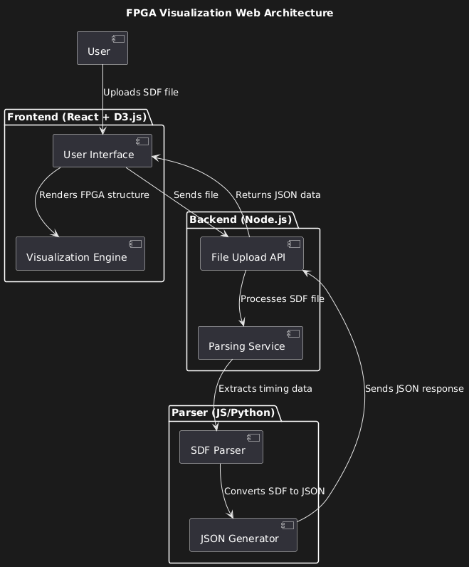
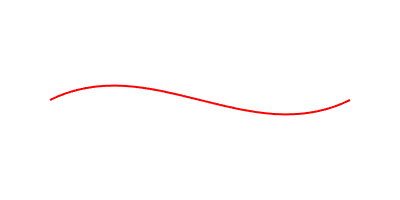

# Technical Specifications - Team 3

## Table of Contents

<details>
<summary>Click to expand</summary>

- [Technical Specifications - Team 3](#technical-specifications---team-3)
  - [Table of Contents](#table-of-contents)
  - [Introduction](#introduction)
    - [Objectives](#objectives)
    - [Why this project?](#why-this-project)
  - [Scope](#scope)
  - [Tasks management](#tasks-management)
    - [Task distribution](#task-distribution)
  - [Schedule](#schedule)
  - [Technologies used](#technologies-used)
  - [Software](#software)
    - [Initial steps](#initial-steps)
    - [Installation](#installation)
    - [Software architecture](#software-architecture)
    - [File and folder structure](#file-and-folder-structure)
    - [Website](#website)
      - [Front end](#front-end)
      - [Back end](#back-end)
        - [File upload](#file-upload)
      - [Parser](#parser)
        - [FPGA Interconnect](#fpga-interconnect)
        - [LUT_K](#lut_k)
        - [DFF](#dff)
    - [FPGA structure generation](#fpga-structure-generation)
      - [back end processing](#back-end-processing)
    - [Visualization](#visualization)
      - [Generate the visualization](#generate-the-visualization)
      - [Wire management and signal propagation simulation](#wire-management-and-signal-propagation-simulation)
        - [1. Wire Management and Routing](#1-wire-management-and-routing)
        - [2. Signal categorization with color coding](#2-signal-categorization-with-color-coding)
        - [3. Signal Styling with CSS](#3-signal-styling-with-css)
        - [4. Signal Propagation Simulation](#4-signal-propagation-simulation)
        - [Bézier curve](#bézier-curve)
          - [Why Bézier Curves?](#why-bézier-curves)
          - [Implementation Details](#implementation-details)
          - [Breaking Down the Bézier Curve Command](#breaking-down-the-bézier-curve-command)
          - [Dynamic Bézier Curve in D3.js](#dynamic-bézier-curve-in-d3js)
          - [Collision Avoidance Strategy](#collision-avoidance-strategy)
      - [Logs](#logs)
        - [Logs creation](#logs-creation)
        - [Logs display](#logs-display)
      - [Step buttons](#step-buttons)
      - [Zoom Buttons](#zoom-buttons)
      - [Panning the Visualization](#panning-the-visualization)
    - [Explanation:](#explanation)
      - [Alternative Navigation Controls (Buttons or Slider)](#alternative-navigation-controls-buttons-or-slider)
  - [Risks and mitigation strategies](#risks-and-mitigation-strategies)
  - [Testing](#testing)
    - [Testing strategy](#testing-strategy)
  - [Scalability and performance](#scalability-and-performance)
  - [Future improvements](#future-improvements)
  - [Glossary](#glossary)

</details>

## Introduction

This project is a commission from the [CNES](https://cnes.fr/) (Centre National d'Études Spatiales), the French space agency.
The purpose of this project is to develop a web-based interface to visualize FPGA signal propagation. The target users include:

- **Teachers** who upload their FPGA designs and use the tool to teach their students.
- **Students** who interact with the simulator to observe and analyze FPGA behavior.

The system doesn't have any mandatory framework or library to use, but the team is free to use any of them. The only constraint is that the system must be web-based. It's the reason why the team chose to use the [React](https://reactjs.org/) library for the front end and the [D3.js](https://d3js.org/) library for the web interface.

### Objectives

The main objective of this project is to provide an interactive 2D visualization of FPGA structures and signal routing. The system should be able to simulate signal propagation in real time with time-based animations, allowing users to see how signals travel through an FPGA design. Teachers should be able to upload Verilog applications and test benches, which students can then use to run and analyze simulations. The interface should be intuitive, engaging, and informative, making it easier for students to grasp the fundamentals of FPGA design and behavior.

### Why this project?

FPGAs are widely used in the aerospace industry for various applications, including satellite communication, image processing, and data acquisition. Understanding how FPGAs work is essential for engineers and researchers working in the aerospace sector. However, learning FPGA design can be challenging due to the complex nature of the hardware and software involved. By providing an interactive visualization tool, we aim to simplify the learning process and make it more accessible to students and teachers. This project aligns with CNES's mission to promote STEM(Science, Technology, Engineering, and Mathematics) education and foster innovation in the aerospace sector.

## Scope

The project is divided into two main parts:

1. **Front end**: The web-based interface that users interact with. This includes the visualization of the FPGA structure and signal propagation, as well as the user interface for uploading and running simulations.
2. **Back end**: The server-side application that handles file uploads, simulation execution, and communication with the front end.

| Item          | In Scope                                                                                                                                                                                          | Out of Scope                                                                                                                                                                                        |
| ------------- | ------------------------------------------------------------------------------------------------------------------------------------------------------------------------------------------------- | --------------------------------------------------------------------------------------------------------------------------------------------------------------------------------------------------- |
| **Front end** | - Visualization of FPGA structures and signal propagation. <br> - User interface for uploading Verilog applications and testbenches. <br> - Manual simulation control (start, stop, pause, step). | - Advanced features like debugging, and waveform analysis. <br> - Support for complex FPGA architectures and designs. <br> - Real-time simulation of signal propagation with time-based animations. |
| **Back end**  | - Handling Verilog file uploads and processing. <br> - Running FPGA simulations and sending results to the front end. <br> - Providing a REST API for communication with the front end.           | - Full-scale FPGA synthesis or hardware implementation. <br> - Integration with proprietary FPGA vendor tools.                                                                                      |

The project will be developed using the following technologies:

- **Front end**: React, D3.js, HTML, CSS, JavaScript.
- **Back end**: Node.js, JavaScript

## Tasks management

The project will be divided into the following tasks:

- **Parsing**: Being able to transform a given `.sdf` file into a JSON object that will be used to generate the FPGA structure.
- **FPGA Structure Generation**: Creating a 2D representation of the FPGA structure based on the JSON object generated from the `.sdf` file.
- **Signal Propagation Simulation**: Simulating signal propagation through the FPGA structure and updating the visualization in real time.
- **User Interface**: Designing an intuitive and interactive user interface for uploading Verilog applications, controlling simulations, and viewing results.
- **Back end Development**: Implementing the server-side application to handle file uploads, simulation execution, and communication with the front end.
- **Integration**: Integrating the front end and back end components to create a seamless user experience.
- **Testing and Debugging**: Testing the system for bugs, performance issues, and usability problems, and fixing them as soon as possible.
- **Documentation**: Writing technical documentation, user guides, and other relevant documentation for the project.

The team will work collaboratively on all tasks, with each member contributing to different aspects of the project based on their role and expertise. Regular meetings will be held to discuss progress, share updates, and address any issues that could arise during development. The team will also reach out to the customer for feedback and validation of the deliverables.

The project is expected to be completed within the specified timeline, with regular updates provided to the customer to ensure alignment with their requirements and expectations.

### Task distribution

The tasks will be distributed among the team members as follows:

- **Parsing**: Camille (SE) and Julian (QA)
- **FPGA Structure Generation**: Camille (SE)
- **Signal Propagation Simulation**: Camille (SE) and Vivien (PGM)
- **User Interface**: Camille (SE) and Vivien (PGM)
- **Back end Development**: Camille (SE) and Alexis (TL)
- **Integration**: Camille (SE), Vivien (PGM) and Alexis (TL)
- **Testing and Debugging**: Julian (QA) and Camille (SE)
- **Documentation**: Paul (TW), Julian (QA) and Camille (SE)

By doing so, each team member will work on multiple tasks, ensuring that everyone has a well-rounded understanding of the project and can contribute effectively to its success.

The team will follow an agile development approach, with regular sprints, stand-up meetings, and retrospectives to track progress, address issues, and make adjustments as needed. The team will also use version control and issue-tracking tools to manage the project and collaborate effectively.

## Schedule

The project will be developed over a period of 6 weeks, with the following milestones:

1. **Week 1**: Project Kickoff, Requirement Analysis, Task Distribution, and Planning.
2. **Week 2**: Parsing and FPGA Structure Generation
3. **Week 3**: Signal Propagation Simulation and User Interface
4. **Week 4**: Back end Development and Integration
5. **Week 5**: Testing and Debugging, Documentation
6. **Week 6**: Final Testing, Deployment, and Delivery

## Technologies used

The project will be developed using the following technologies:

- [**Vite**](https://vite.dev/): A fast-build tool that provides a modern development environment for front end projects. (Vite 5)
- **React**: A JavaScript library for building user interfaces. (React 19)
- **D3.js**: A JavaScript library for creating interactive data visualizations. (D3.js 7.9)

## Software

### Initial steps

The software will be implemented by using React. To do so, here are the initial steps:

1. In your cmd, go to the repository and enter the following commands

```bash
npm create vite@latest
```

After entering the command, the command prompt will ask you these questions:

```bash
Need to install the following packages:
create-vite@4.1.0
Ok to proceed? (y)

Project name: Web-FPGA

Package name: web-fpga

Select a framework: React

Select a variant: JavaScript
```

Once you're done with it, the project will be created and you can start working on it.

2. To run the project, you can use the following command:

```bash
cd web-fpga
npm install
npm run dev
```

3. To build the project, you can use the following command:

```bash
npm run build
```

### Installation

If, instead, you want to contribute to the project, you can clone the repository and install the dependencies by running the following commands:

```bash
git clone https://github.com/algosup/2024-2025-project-4-web-fpga-team-3.git
cd 2024-2025-project-4-web-fpga-team-3
npm install
```

To run the project, you can use the following command:

```bash
npm run dev
```

You will be able to access the project at the following address: `http://localhost:XXXX`, where `XXXX` is the port number.

### Software architecture

The software architecture will be based on the following components:

- The website, a single-page application built with React, will provide the user interface for interacting with the FPGA simulator.
- The FPGA simulator, implemented in D3.js and JavaScript, will handle the simulation of signal propagation through the FPGA structure.
- The parser, written in JavaScript, will convert the `.sdf` file into a JSON object that can be used to generate the FPGA structure.
- The back end server, built with Node.js, will handle file uploads, simulation execution, and communication with the front end.

Here's a look at the high-level architecture of the system:



The software architecture of this FPGA visualization web application is structured into three main components: the Front end, the back end, and the Parser. The front, built with React and D3.js, provides an interactive user interface where users can upload an SDF file and visualize the FPGA structure. Once a file is uploaded, it is sent to the back end via an API.

The back end, developed with Node.js, acts as an intermediary between the front end and the Parser. It receives the uploaded SDF file through the File Upload API and forwards it to the Parsing Service, which is responsible for extracting relevant timing and structural data from the file.

The Parser, implemented in JavaScript or Python, processes the SDF file, extracts information about timing constraints and component connections, and converts it into a JSON format that the front end can easily interpret. The back end then returns this JSON data to the Front end, which uses it to dynamically render the FPGA structure, allowing users to explore signal connections and propagation through an intuitive visualization.

This modular architecture ensures scalability, separation of concerns, and efficient processing of FPGA-related data, making it adaptable for future extensions and improvements.

### File and folder structure

The file and folder structure of the project will be organized as follows:

```plaintext
Web-FPGA/
├── public/
│   └── favicon.ico
├── src/
│   ├── components/
│   │   ├── Header.js
│   │   ├── Sidebar.js
│   │   ├── MainContent.js
│   │   └── Footer.js
│   ├── pages/
│   │   ├── MainPage.js
│   │   ├── UploadPage.js
│   │   ├── SimulationPage.js
│   │   └── ResultsPage.js
│   ├── services/
│   │   ├── api.js
│   │   ├── parser.js
│   │   └── simulator.js
│   ├── App.js
│   ├── index.js
│   └── styles.css
├── index.html
├── package.json
├── vite.config.js
├── README.md
└── .gitignore
```

> [!NOTE]
> I've deliberately omitted the `node_modules` folder, as there's no need to show it here. The same applies to the documentation folder.

The project will be structured into the following main directories:

- **public**: Contains static assets like `favicon.ico`.
- **src**: Contains the project's source code.
  - **components**: Contains reusable React components like `Header`, `Sidebar`, `MainContent`, and `Footer`.
  - **pages**: Contains the main pages of the application like `MainPage`, `UploadPage`, `SimulationPage`, and `ResultsPage`.
  - **Services**: Contains utility functions and services like `api`, `parser`, and `simulator`.
  - **App.js**: The main React component that renders the application.
  - **index.js**: The entry point of the application.
  - **styles.css**: Contains global styles for the application.
- **index.html**: The main HTML file that loads the React application.
- **package.json**: Contains project metadata and dependencies.
- **vite.config.js**: Contains configuration settings for the Vite build tool.

### Website

The goal of the website is to provide an intuitive and interactive user interface for uploading Verilog applications, running simulations, visualizing FPGA structures, and signal propagation.

#### Front end

Based on the mockup approved by the customer, the front end will consist of the following components:

- **Main content**: The main content area where the FPGA structure visualization will be displayed. This will include the FPGA grid, signal lines, and interactive components for controlling simulations such as arrows to move backward and forward in time.
- **Sidebar**: The sidebar area where logs will be displayed.
- **Header**: The header area with the project name and a button for uploading files.
- **Footer**: The footer area has copyright information and links to relevant resources.
- **Upload Form**: A dedicated form for uploading `.sdf` files that will appear when the user clicks the upload button in the header or at the start of the application.

The front end will be implemented using React, D3.js to create an engaging and interactive user experience. The team will follow best practices for web development, including responsive design, accessibility, and performance optimization, to ensure that the application is user-friendly and accessible to a wide range of users.

To ensure the best practices are followed, the team will use the following rules:

- **Test before implementing**: Before implementing a new feature, the team will test it in simple code (HTML, CSS, JS) to ensure it works as expected. Once it's done, the team will implement it in the project, in jsx and css.
- **Code review**: Before merging a pull request, the team will review the code to ensure it follows the best practices and the project's guidelines.
- **Testing**: The team will test the project on different devices and browsers to ensure it's responsive and accessible to all users.
- **Performance**: The team will optimize the project to ensure it loads quickly and runs smoothly on all devices.

For more details on the practices to follow, please refer to the [following article](https://www.geeksforgeeks.org/web-development-best-practices/).

#### Back end

The back end will be responsible for **handling file uploads**, **running simulations**, and **communicating with the front end**. It will be implemented using Node.js and Express.js to create a **RESTful API** with which the front end can interact. The back end will include the following components:

- **File Upload API**: An API endpoint for uploading `.sdf` files to the server.
- **Parser Service**: A service for parsing `.sdf` files and extracting relevant data for simulations.
- **Simulation API**: An API endpoint for running simulations and returning the results to the front end.
- **Simulation Service**: A service for simulating signal propagation through the FPGA structure and updating the front end with the results.

The most important and complex part of the back end will be the parser service, which will be responsible for parsing `.sdf` files and converting them into a format that the front end can use to generate the FPGA structure visualization. The team will pay specific attention to error handling, data validation, and performance optimization to ensure that the parser service is robust, reliable, and efficient.

##### File upload

Uploading the file isn't too complex, but it's important to handle it correctly. The team will use the following steps to handle the file upload:

1. **Interaction**: The user will click on the upload button in the header or at the start of the application.
2. **File selection**: The user will select the `.sdf` file to upload.
3. **File upload**: The file will be uploaded to the website
4. **File processing**: The file will be processed by the back end to extract the relevant data.
5. **File saving**: The transformed file will be saved in the local cache.

#### Parser

The parser will be implemented in JavaScript or Python, depending on the team's expertise and preferences. It will read the `.sdf` file, extract relevant information about the FPGA structure, and convert it into a JSON object that can be easily used by the front end. The parser will handle different types of cells, delays, and connections, ensuring that the data is accurate and consistent for visualization and simulation.

> [!WARNING]
> Important information to know is that the delay is in picoseconds. In the first lines of the `.sdf` file, you can find the time unit used in the file.
>
> ```sdf
> (TIMESCALE 1ps)
> ```

Here are all the types of cells we might find in the `.sdf` file:

##### FPGA Interconnect

```sdf
 (CELL
 (CELLTYPE "fpga_interconnect")
 (INSTANCE routing_segment_D_output_0_0_to_lut_\$auto\$rtlil\.cc\:2714\:MuxGate\$175_input_0_3)
 (DELAY
 (ABSOLUTE
 (IOPATH datain dataout (235.697:235.697:235.697) (235.697:235.697:235.697))
 )
 )
 )
```

Those simply link two points and delay this interaction. In the case just above, to go from `segment_D_output_0_0` to `lut_\$auto\$rtlil\.cc\:2714\:MuxGate\$175_input_0_3`, it will take 235.697 picoseconds/ps (10⁻¹² second).

The information we need to extract from this cell is the following:

- The type of the cell: `fpga_interconnect`
- The starting point: `segment_D_output_0_0`
- The ending point: `lut_\$auto\$rtlil\.cc\:2714\:MuxGate\$175_input_0_3`
- The delay: `235.697`

##### LUT_K

```sdf
 (CELL
 (CELLTYPE "LUT_K")
 (INSTANCE lut_\$auto\$rtlil\.cc\:2714\:MuxGate\$139)
 (DELAY
 (ABSOLUTE
 (IOPATH in[1] out (152:152:152) (152:152:152))
 (IOPATH in[2] out (150:150:150) (150:150:150))
 (IOPATH in[3] out (150:150:150) (150:150:150))
 )
 )
 )
```

Those are the LUTs, which are the basic components of the FPGA. They are used to store the logic of the FPGA. In the case just above, the LUT is named `lut_\$auto\$rtlil\.cc\:2714\:MuxGate\$139`.

The information we need to extract from this cell is the following:

- The type of the cell: `LUT_K`
- The name of the LUT: `lut_\$auto\$rtlil\.cc\:2714\:MuxGate\$139`
- The delays for each input: `152`, `150`, `150`

##### DFF

```sdf
 (CELL
 (CELLTYPE "DFF")
 (INSTANCE latch_Q)
 (DELAY
 (ABSOLUTE
 (IOPATH (posedge clock) Q (303:303:303) (303:303:303))
 )
 )
 (TIMINGCHECK
 (SETUP D (posedge clock) (-46:-46:-46))
 )
 )
```

Those are the DFFs, which are used to store the state of the FPGA. In the case just above, the DFF is named `latch_Q`. The DFF is triggered by the rising edge of the clock.

The information we need to extract from this cell is the following:

- The type of the cell: `DFF`
- The name of the DFF: `latch_Q`
- The delay for the clock: `303`
- The timing check for the setup: `-46`

Here's a hypothetical example of the JSON object that the parser might generate based on the `.sdf` file:

```json
{
  "cells": [
    {
      "type": "fpga_interconnect",
      "start": "segment_D_output_0_0",
      "end": "lut_$auto$rtlil.cc:2714:MuxGate$175_input_0_3",
      "delay": 235.697
    },
    {
      "type": "LUT_K",
      "name": "lut_$auto$rtlil.cc:2714:MuxGate$139",
      "delays": [152, 150, 150]
    },
    {
      "type": "DFF",
      "name": "latch_Q",
      "delay": 303,
      "timing_check": -46
    }
  ]
}
```

The parser will be designed to handle different types of cells, delays, and connections, ensuring that the data is accurate and consistent for visualization and simulation.

### FPGA structure generation

This section explains how the JSON data extracted from the .sdf file is used to generate an interactive visualization of the FPGA. The goal is to correctly **place**, **connect**, and **simulate** the different components while allowing user interactions to observe and manipulate signal propagation.

#### back end processing

Once the `.sdf` file is parsed and converted into JSON, the back end is responsible for extracting the relevant data and constructing a logical representation of the FPGA.

The steps are the following:

1. Load the JSON data from the parser service.
2. Extract all cell instances and categorize them by type (e.g., LUTs, DFFs, interconnects).
3. Create a graph structure where:
   - Nodes represent an FPGA cell.
   - Edges represent a signal connection between two cells.
4. Optimize the graph by removing redundant connections and structuring the data for efficient front end rendering.
5. Send the optimized graph data to the front end for visualization.

Example of a graph structure:

```json
{
  "nodes": [
    { "id": "DFF1", "type": "DFF", "tick": 303 },
    { "id": "LUT1", "type": "LUT" },
    { "id": "High1", "type": "HighConst" },
    { "id": "Input1", "type": "Input" }
  ],
  "edges": [
    { "source": "DFF1", "target": "LUT1", "delay": 152 },
    { "source": "High1", "target": "LUT1", "delay": 150 },
    { "source": "Input1", "target": "LUT1", "delay": 150 }
  ]
}
```

In the example above, we have four nodes representing a DFF, a LUT, a high constant, and an input. The edges represent signal connections between the nodes, with delays specified for each connection.

The front end will use this graph data to render the FPGA structure, visualize signal propagation, and provide interactive controls for running simulations and observing results.

### Visualization

Now that the `.json` file has been structured, the back end must process this data to create a logical representation of the FPGA. The front end will then use this data to render an interactive visualization of the FPGA structure and signal propagation.

#### Generate the visualization

- Nodes are dynamically placed on a grid based on their type and connections.
- Edges are drawn between nodes to represent signal connections, with different colors and styles to indicate signal propagation.
- Simulation can now run step-by-step.

To match the requirement the first time, the team will use a simple representation of the FPGA structure, with basic shapes for nodes and lines for connections. The team will focus on functionality first, ensuring that the visualization accurately represents the FPGA structure and signal propagation.

Placement will be important for the first part, as we need to be readable and easy to understand for all users. As our client is based in Europe, reading from left to right, the team will place the user inputs on the left side and the outputs on the right side. The DFFs and LUTs will be placed in the middle, with the interconnects connecting them.

The first expected version should be a simple square with the ID of the component in the middle. The edges will be simple lines connecting the components, with no color, no thickness, and no animation.

#### Wire management and signal propagation simulation

The front end will use **D3.js** to create a dynamic visualization of the board allowing users to observe signal propagation and analyze the FPGA design.

##### 1. Wire Management and Routing

To ensure **clarity, accuracy, and interactivity** in FPGA wire visualization, the system will implement the following:

- **Dynamic Wire Rendering:**

  - Connections will be represented using **SVG paths (`<path>`)**, with smooth **curved** or **straight-line routing** for optimal readability.
  - Wire paths will automatically **adjust** as nodes move, maintaining a clean layout.

- **Automated Routing & Overlap Prevention:**

  - The system will implement **collision-aware routing** to avoid **wire congestion**.
  - **Spacing algorithms** will ensure clear separation between overlapping signals.
  - **Grid-based or force-directed layouts** will help position connections logically.

- **Interactive Wire Adjustments:**
  - The system will **auto-snap wires** to valid positions, ensuring accurate routing.
  - **Hover effects** will highlight the source and destination of each connection.

##### 2. Signal categorization with color coding

To differentiate signal types and improve readability, a **color-coded system** will be applied:

| Signal Type | Default Color | "On" State (Brighter)        |
| ----------- | ------------- | ---------------------------- |
| **Clock**   | 🔴 Red        | 🔴 Brighter Red (Thicker)    |
| **Data**    | 🟢 Green      | 🟢 Brighter Green (Thicker)  |
| **Control** | 🔵 Blue       | 🔵 Brighter Blue (Thicker)   |
| **Reset**   | 🟡 Yellow     | 🟡 Brighter Yellow (Thicker) |
| **Other**   | ⚫ Black      | ⚫ Brighter Black (Thicker)  |
| **Unused**  | ⚪ Gray       | /                            |

When a signal is active, the corresponding wire will **increase in brightness and thickness**, making propagation visually distinct.

##### 3. Signal Styling with CSS

To implement this, CSS classes will be used:

```css
/* Default state */
.signal__clock {
  stroke: #ff0000;
}

/* Active signal */
.signal__clock--on {
  stroke: #ff3333;
  stroke-width: 2;
}
```

This logic will be applied to all signals, ensuring real-time updates in response to simulation data.

##### 4. Signal Propagation Simulation

The simulation will model real FPGA signal behavior based on delays extracted from the `.sdf` file. Key features:

- **Time-based animation** to show signals traveling across interconnects.
- **Step-through controls** to pause, rewind, and fast-forward propagation.
- **Live updates on signal states**, highlighting active paths and values.

As signals move, affected wires will animate accordingly, transitioning from off to on states using the defined color and thickness rules. Providing a clear visual representation of signal propagation will enhance user understanding and engagement.

> [!NOTE]
> The visualization will be designed to be user-friendly, interactive, and informative, providing a clear and intuitive representation of the FPGA structure and signal propagation, as you might see in the mockup shared in the [Functional Specifications](../FunctionalSpecifications/FunctionalSpecifications.md).

##### Bézier curve

To prevent **wire congestion and overlapping connections**, the system will use **Bézier curves** for routing. Bézier curves allow for **smooth, visually distinct paths**, making complex FPGA wiring easier to follow.

###### Why Bézier Curves?

- They provide a **cleaner** and **more readable** representation of signal paths.
- Unlike straight lines, Bézier curves help prevent visual clutter when multiple wires are present.
- They allow **dynamic adjustments**, automatically updating when nodes move.

###### Implementation Details

Bézier curves in **SVG** can be created using the `C` (cubic Bézier) or `Q` (quadratic Bézier) command in an `<svg>` `<path>` element.

Example of an **SVG Bézier curve** for routing a wire between two FPGA nodes:

```html
<svg width="400" height="200">
  <path
    d="M 50,100 C 150,50 250,150 350,100"
    stroke="red"
    fill="transparent"
    stroke-width="2"
  />
</svg>
```



###### Breaking Down the Bézier Curve Command

```plaintext
M 50,100    → Move to starting point (x=50, y=100)
C 150,50    → First control point (x=150, y=50)
 250,150   → Second control point (x=250, y=150)
 350,100   → Endpoint (x=350, y=100)
```

- **Control points** define the curve's shape.
- The **closer** a control point is to a segment, the more influence it has on the curve.

###### Dynamic Bézier Curve in D3.js

To generate dynamic routing, D3.js can be used to update Bézier paths **automatically** based on node positions:

```js
const link = d3
  .select("svg")
  .append("path")
  .attr(
    "d",
    `M ${x1},${y1} C ${x1 + 50},${y1 - 50}, ${x2 - 50},${y2 + 50}, ${x2},${y2}`
  )
  .attr("stroke", "black")
  .attr("fill", "none")
  .attr("stroke-width", 2);
```

###### Collision Avoidance Strategy

1. **Dynamic Control Points:**
   - Adjust **control points dynamically** to curve around obstacles.
2. **Spacing Constraints:**
   - Prevent overlapping by checking distances between parallel wires.
3. **Force-Directed Layouts:**
   - Use **D3.js force simulations** to push wires apart for better clarity.

#### Logs

One key feature of this project is the ability to display logs to the user. The logs will be displayed in the sidebar of the application and will provide information on the simulation based on the time and the step.

##### Logs creation

The logs will be created based on the simulation data and user interactions. The logs will include information about the simulation status, signal propagation, and user actions. Each log entry will be timestamped to indicate when it occurred. Each log entry will be saved in an array or object that can be accessed and updated as needed.

To be able to create logs, the team will need to create a function that will look into the `.json` file and extract the relevant information to create the logs. The logs will be created based on the simulation data and user interactions. The logs will include information about the simulation status, signal propagation, and user actions. Each log entry will be timestamped to indicate when it occurred.

Here's a hypothetical example of how the logs might be created in the back end:

```js
const logs = [];

function logEvent(timestamp, message) {
  logs.push({ timestamp, message });
}
```

The function `logEvent` will be used to create a new log entry with a timestamp and a message. The logs will be stored in an array called `logs`, which can be accessed and updated as needed. This function will be called whenever an event occurs that requires logging, such as the start of the simulation, signal propagation, or user interactions.

##### Logs display

The logs will be displayed in chronological order, with the oldest logs at the top and the newest logs at the bottom. Each log entry will include the following information:

- **Timestamp**: The time at which the log entry was generated.
- **Message**: A brief description of the event or action that triggered the log entry.

The logs will be saved in an invisible table, with each row representing a log entry and each column representing a different field (timestamp, message). The logs will be updated based on the steps button the user clicks.

Here's a hypothetical example of how the logs might be displayed in the sidebar:

```plaintext
00:00 Simulation started
00:10 Signal A propagated from LUT1 to DFF1
00:25 Signal B propagated from Input1 to LUT1
00:53 Simulation paused
```

#### Step buttons

The step buttons will allow the user to control the simulation by moving forward or backward in time. The step buttons will be displayed in the header of the application and will include the following options:

- **Start**: Move to the beginning of the simulation.
- **Previous**: Move back one step in the simulation.
- **Next**: Move forward one step in the simulation.
- **End**: Move to the end of the simulation.

The step buttons will be implemented using HTML buttons with event listeners to handle user interactions. When a step button is clicked, the simulation will update the visualization and logs to reflect the current state of the simulation at the selected time.

Here's a hypothetical example of how the step buttons might be implemented in the front end:

```js
const first = document.getElementById("start-btn");
const previous = document.getElementById("previous-btn");
const next = document.getElementById("next-btn");
const last = document.getElementById("end-btn");
const logTable = document.getElementById("log-table");
const stepValue = document.getElementById("step-value");

let currentStep = 0;

first.addEventListener("click", () => {
  currentStep = 0;
  stepValue.textContent = currentStep;
  updateLogs(currentStep);
});

previous.addEventListener("click", () => {
  if (currentStep > 0) {
    currentStep--;
    stepValue.textContent = currentStep;
    updateLogs(currentStep);
  }
});

next.addEventListener("click", () => {
  if (currentStep < logs.length - 1) {
    currentStep++;
    stepValue.textContent = currentStep;
    updateLogs(currentStep);
  }
});

last.addEventListener("click", () => {
  currentStep = logs.length - 1;
  stepValue.textContent = currentStep;
  updateLogs(currentStep);
});

function updateLogs(step) {
  logTable.innerHTML = "";
  for (let i = 0; i <= step; i++) {
    const log = logs[i];
    const row = document.createElement("tr");
    const timestampCell = document.createElement("td");
    const messageCell = document.createElement("td");
    timestampCell.textContent = log.timestamp;
    messageCell.textContent = log.message;
    row.appendChild(timestampCell);
    row.appendChild(messageCell);
    logTable.appendChild(row);
  }
}
```

As you might see in the pseudo-code above, the logs will be updated based on the steps the user clicks. The user will be able to go back and forth in the simulation to see the logs at different times. If the backward button is pressed, the logs will be updated to show the logs at the previous step. If the forward button is pressed, the logs will be updated to show the logs at the next step.

#### Zoom Buttons

The zoom buttons will allow the user to control the zoom level of the FPGA structure visualization. The zoom buttons will be displayed in the footer of the application and will include the following options:

- **Zoom In**: Increase the zoom level of the visualization.
- **Zoom Out**: Decrease the zoom level of the visualization.

The zoom buttons will be implemented using HTML buttons with event listeners to handle user interactions. When a zoom button is clicked, the visualization will update to reflect the new zoom level, making it easier for users to explore the FPGA structure and signal propagation.

Here's a hypothetical example of how the zoom buttons might be implemented in the front end:

```js
const zoomIn = document.getElementById("zoom-in-btn");
const zoomOut = document.getElementById("zoom-out-btn");

let zoomLevel = 1;
const maxZoom = 3; // Maximum zoom level
const minZoom = 0.5; // Minimum zoom level

// Store the visualization element that needs zooming
const visualization = document.getElementById("fpga-window");

zoomIn.addEventListener("click", () => {
  if (zoomLevel < maxZoom) {
    zoomLevel += 0.1;
    updateZoom(zoomLevel);
  }
});

zoomOut.addEventListener("click", () => {
  if (zoomLevel > minZoom) {
    zoomLevel -= 0.1;
    updateZoom(zoomLevel);
  }
});

function updateZoom(level) {
  // Apply the scale transform to the visualization element
  visualization.style.transform = `scale(${level})`;
  visualization.style.transformOrigin = "center center"; // Keep the scaling centered
  console.log(`Zoom Level: ${level}`);
}
```

As you might see in the pseudo-code above, the zoom level will be updated based on the zoom button the user clicks. The user will be able to zoom in and out of the visualization to explore the FPGA structure and signal propagation at different levels of detail.

#### Panning the Visualization

When users zoom in on the FPGA structure, they may need to pan across the visualization to explore different sections of the structure. This can be achieved by allowing the user to drag or use navigation controls such as buttons or a slider.

To implement this, we can add a simple panning feature using mouse dragging and/or arrow buttons. Here's an example of how the panning functionality might be implemented:

```js
let isPanning = false;
let startX = 0;
let startY = 0;

visualization.addEventListener("mousedown", (e) => {
  isPanning = true;
  startX = e.clientX;
  startY = e.clientY;
});

visualization.addEventListener("mousemove", (e) => {
  if (isPanning) {
    const dx = e.clientX - startX;
    const dy = e.clientY - startY;
    visualization.style.transform = `scale(${zoomLevel}) translate(${dx}px, ${dy}px)`;
  }
});

visualization.addEventListener("mouseup", () => {
  isPanning = false;
});

visualization.addEventListener("mouseleave", () => {
  isPanning = false;
});
```

### Explanation:

- **Panning**: The user can click and drag the mouse to move the visualization (translate it) across the screen. When the mouse is pressed down, the `mousedown` event starts the panning, and the `mousemove` event is used to apply the translation based on how far the mouse has moved.
- **Mouse Up/Leave**: When the user releases the mouse or leaves the visualization area, the panning stops.

#### Alternative Navigation Controls (Buttons or Slider)

In addition to panning via mouse dragging, we could also provide a set of navigation controls (like arrow buttons or a slider) for panning the visualization horizontally and vertically. Here's an example of a horizontal slider that moves the visualization left and right:

```html
<div id="horizontal-slider">
  <input type="range" min="0" max="100" value="50" id="slider" />
</div>

<script>
  const slider = document.getElementById("slider");

  slider.addEventListener("input", (e) => {
    const sliderValue = e.target.value;
    const offset = sliderValue - 50; // Centered at 50
    visualization.style.transform = `scale(${zoomLevel}) translateX(${offset}px)`;
  });
</script>
```

This code creates a horizontal slider that lets users move the FPGA structure left and right based on the zoom level. You can also implement vertical sliders or arrow buttons for more fine-grained control over panning.

## Risks and mitigation strategies

The project may face several risks during development, including technical challenges, resource constraints, and schedule delays. To mitigate these risks, the team has identified the following strategies:

1. **Technical Risks**: The team may encounter technical challenges related to parsing SDF files, simulating signal propagation, or integrating front end and back end components. To mitigate these risks, the team will conduct thorough research, seek expert advice, and leverage online resources to address technical issues as they arise.
2. **Resource Constraints**: The team may face resource constraints, such as limited access to hardware, software, or expertise. To mitigate these risks, the team will collaborate with the customer, leverage open-source tools and libraries, and seek external support if needed.
3. **Schedule Delays**: The project may experience delays due to unforeseen circumstances, such as technical setbacks, scope changes, or resource limitations. To mitigate these risks, the team will maintain regular communication, track progress, and adjust the project plan as needed to ensure timely delivery.

By identifying potential risks and implementing mitigation strategies, the team aims to minimize the impact of unforeseen challenges and ensure the successful completion of the project.

## Testing

The testing part of the project will be done using the following tools:

- **Jest**: For unit testing of individual components and functions.
- **React Testing Library**: This is for integration testing of React components and user interactions.
- **Cypress**: For end-to-end testing of the entire application flow, including file uploads, simulations, and visualizations.
- **Postman**: For testing the REST API endpoints and verifying data exchange between the front end and back end.
- **Manual Testing**: For exploratory testing, usability testing, and edge case scenarios that may not be covered by automated tests.

### Testing strategy

The testing strategy will be based on the following principles:

- **Test Early, Test Often**: Testing will be integrated into the development process from the beginning, with unit tests written for individual components and functions as they are implemented.
- **Automate Where Possible**: Automated tests will be used to validate critical functionality, reduce manual effort, and ensure consistent test coverage across the application.
- **Test Coverage**: The team will strive to achieve high test coverage, focusing on key features, edge cases, and error scenarios to ensure the reliability and robustness of the application.
- **Regression Testing**: Regression tests will be run regularly to detect and prevent regressions, ensuring that new changes do not introduce unintended side effects or break existing functionalities.
- **User-Centric Testing**: Usability testing, accessibility testing, and user feedback will be incorporated into the testing process to validate the user experience and address usability issues early in the development cycle.

## Scalability and performance

The project will be designed to be scalable and performant, allowing it to handle large FPGA designs, complex simulations, and high user traffic. To achieve this, the team will follow best practices for web development, including:

- **Optimized Code**: Writing clean, efficient, and well-structured code to minimize resource usage and improve performance.
- **Caching**: Implementing caching mechanisms to store and reuse data, reducing the need for repeated computations and improving response times.
- **Lazy Loading**: Loading components, data, and resources only when needed to reduce initial load times and improve user experience.
- **Code Splitting**: Splitting the code into smaller modules and loading them on demand to reduce the initial bundle size and improve loading times.
- **Error Handling**: Implementing robust error handling mechanisms to gracefully handle exceptions, prevent crashes, and provide meaningful feedback to users.
- **Monitoring and Analytics**: Using monitoring tools and analytics to track performance metrics, identify bottlenecks, and optimize the application for scalability and performance.
- **Load Testing**: Conducting load tests to simulate high user traffic, measure system performance under stress, and identify areas for improvement.
- **Scalable Architecture**: Designing a modular, scalable architecture that can be easily extended, modified, and adapted to meet changing requirements and accommodate future growth.

By following these best practices and principles, the team aims to create a scalable, performant, and reliable application that can meet the needs of users, handle complex simulations, and provide an engaging and interactive experience for learning FPGA design.

## Future improvements

Here's a list of potential improvements that could be made to the project in the future:

- **Oscilloscope Mode**: Implement an oscilloscope mode that allows users to view waveforms and analyze signal behavior in more detail.
- **Debugging Tools**: Add debugging tools like breakpoints, variable inspection, and step-by-step execution to help users troubleshoot and analyze FPGA designs.
- **Waveform Analysis**: Integrate waveform analysis tools that allow users to visualize and analyze signal waveforms, timing diagrams, and other relevant data.
- **Real-Time Simulation**: Implement real-time simulation of signal propagation with time-based animations, allowing users to observe signal behavior as it happens, rather than step-by-step.
- **Advanced Features**: Add advanced features like clock domain crossing analysis, timing constraints validation, and power analysis to provide a comprehensive FPGA design and analysis tool.
- **Collaborative Editing**: Enable collaborative editing and sharing of FPGA designs, simulations, and results, allowing multiple users to work together on the same project.
- **Cloud Integration**: Integrate with cloud services to provide scalable storage, processing, and collaboration features for users working on large FPGA designs and simulations.
- **Edition**: Add the possibility to edit the simulation, add new components, change the connections, change the delays, etc.
- **Export**: Add the possibility to export the simulation, save it, share it, etc.

## Glossary

| Term                  | Definition                                                                                                                                               |
| --------------------- | -------------------------------------------------------------------------------------------------------------------------------------------------------- |
| Bézier curve          | A type of curve that is defined by a set of control points and is used in computer graphics and animation to create smooth, flowing shapes.              |
| CNES                  | Centre National d'Études Spatiales, the French space agency.                                                                                             |
| Cypress               | An end-to-end testing framework for web applications.                                                                                                    |
| D3.js                 | A JavaScript library for creating interactive data visualizations.                                                                                       |
| DFF                   | Data Flip-Flop, a sequential logic element that stores a single bit of data.                                                                             |
| Express.js            | A web application framework for Node.js that simplifies the development of server-side applications.                                                     |
| FPGA                  | Field-Programmable Gate Array, a type of integrated circuit that can be configured by the user after manufacturing.                                      |
| FPGA Interconnect     | The routing structure that connects different components of an FPGA.                                                                                     |
| Graph                 | A data structure that consists of nodes (vertices) and edges (connections) between them.                                                                 |
| Jest                  | A JavaScript testing framework that is used to test JavaScript code.                                                                                     |
| JSON                  | JavaScript Object Notation, a lightweight data interchange format that is easy for humans to read and write and easy for machines to parse and generate. |
| LUT                   | Look-Up Table, a basic building block of an FPGA that stores logic functions.                                                                            |
| Node.js               | A JavaScript runtime environment that allows developers to run JavaScript on the server side.                                                            |
| Postman               | A collaboration platform for API development that allows users to test, develop, and document APIs.                                                      |
| React                 | A JavaScript library for building user interfaces.                                                                                                       |
| React Testing Library | A testing library for React that provides utilities for testing React components.                                                                        |
| REST API              | Representational State Transfer Application Programming Interface, a set of rules for building web services that adhere to the REST architectural style. |
| SDF                   | Standard Delay Format, a file format used to specify timing information for digital circuits.                                                            |
| SVG                   | Scalable Vector Graphics, an XML-based vector image format for two-dimensional graphics.                                                                 |
| Vite                  | A fast-build tool that provides a modern development environment for front end projects.                                                                 |
